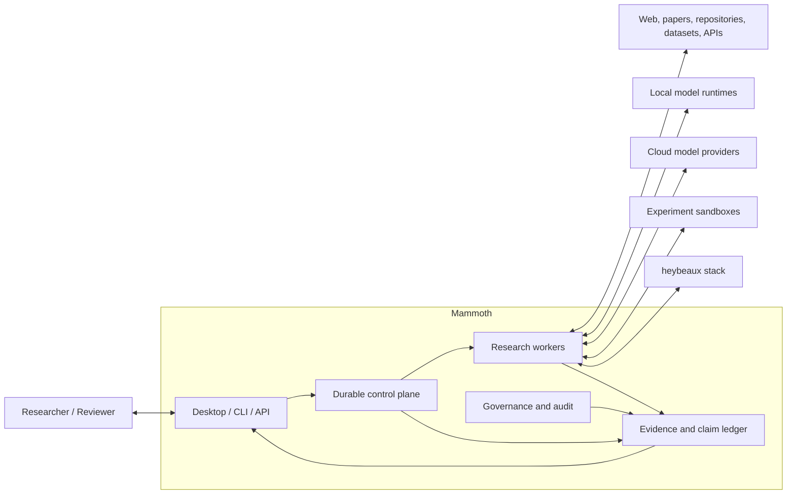
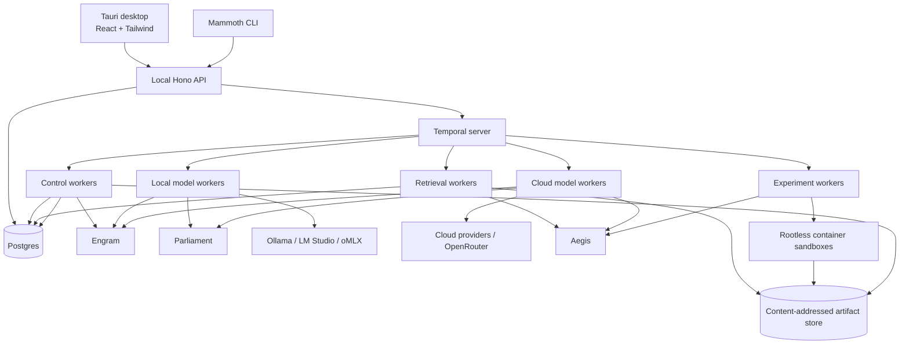
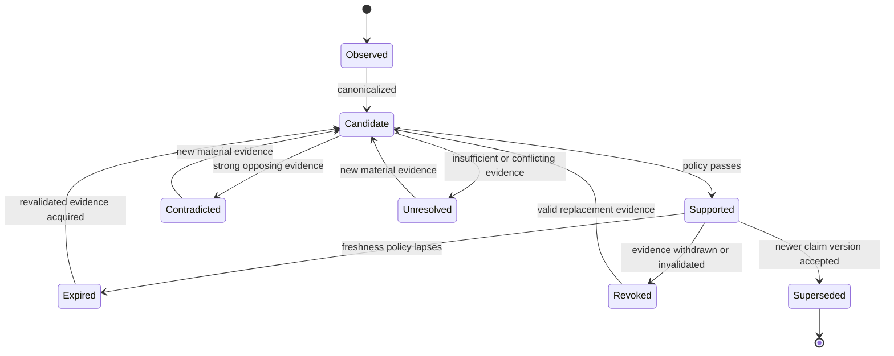

# Mammoth Architecture

> **Status:** Draft architecture specification  
> **Version:** 0.1.0  
> **Last updated:** 2026-07-10  
> **Primary repository:** `heybeaux/mammoth`  
> **Pipeline repository:** `heybeaux/mammoth-pipelines`

Mammoth is a local-first, hybrid-compute research operating system for long-horizon, evidence-bound reasoning. It coordinates local and cloud-hosted models, retrieval systems, deterministic evaluators, experiments, human review, and the wider heybeaux agent stack to investigate difficult questions over hours, days, or weeks.

Mammoth is not designed to produce the fastest plausible answer. It is designed to produce the strongest inspectable body of work that the available evidence, evaluators, time, and compute justify.

---

## Table of contents

1. [Document conventions](#1-document-conventions)
2. [Executive summary](#2-executive-summary)
3. [Problem statement](#3-problem-statement)
4. [Goals](#4-goals)
5. [Non-goals](#5-non-goals)
6. [System invariants](#6-system-invariants)
7. [Repository and product boundaries](#7-repository-and-product-boundaries)
8. [System context](#8-system-context)
9. [Architectural planes](#9-architectural-planes)
10. [Runtime topology](#10-runtime-topology)
11. [Core domain model](#11-core-domain-model)
12. [Claim lifecycle](#12-claim-lifecycle)
13. [Evidence and verification model](#13-evidence-and-verification-model)
14. [Research program lifecycle](#14-research-program-lifecycle)
15. [Durable orchestration](#15-durable-orchestration)
16. [Work items and handoffs](#16-work-items-and-handoffs)
17. [Compute and model routing](#17-compute-and-model-routing)
18. [Parliament integration](#18-parliament-integration)
19. [Novelty and quality-diversity](#19-novelty-and-quality-diversity)
20. [Experiments and evaluators](#20-experiments-and-evaluators)
21. [Current-world research and revalidation](#21-current-world-research-and-revalidation)
22. [Memory architecture](#22-memory-architecture)
23. [Governance and guardrails](#23-governance-and-guardrails)
24. [Audit, provenance, and receipts](#24-audit-provenance-and-receipts)
25. [Evidence-bound report compilation](#25-evidence-bound-report-compilation)
26. [Human intervention](#26-human-intervention)
27. [Security and threat model](#27-security-and-threat-model)
28. [Persistence and data ownership](#28-persistence-and-data-ownership)
29. [API architecture](#29-api-architecture)
30. [Event architecture](#30-event-architecture)
31. [Failure handling and recovery](#31-failure-handling-and-recovery)
32. [Observability and product metrics](#32-observability-and-product-metrics)
33. [Testing and evaluation](#33-testing-and-evaluation)
34. [Local deployment](#34-local-deployment)
35. [`mammoth` repository layout](#35-mammoth-repository-layout)
36. [`mammoth-pipelines` repository layout](#36-mammoth-pipelines-repository-layout)
37. [Pipeline contract](#37-pipeline-contract)
38. [Dependency rules](#38-dependency-rules)
39. [Configuration](#39-configuration)
40. [Development standards](#40-development-standards)
41. [Release, compatibility, and migrations](#41-release-compatibility-and-migrations)
42. [Phased delivery plan](#42-phased-delivery-plan)
43. [Open architectural decisions](#43-open-architectural-decisions)
44. [Definition of done](#44-definition-of-done)
45. [Glossary](#45-glossary)

---

## 1. Document conventions

The key words **MUST**, **MUST NOT**, **REQUIRED**, **SHOULD**, **SHOULD NOT**, and **MAY** are to be interpreted as normative requirements.

This document distinguishes several categories of information:

- A **claim** is an atomic proposition about the world, the system, an experiment, or a proposed mechanism.
- An **observation** is information emitted by a model, tool, human, or process. It is not automatically a claim the system accepts.
- A **hypothesis** is an explicitly falsifiable candidate explanation, design, mechanism, or prediction.
- **Evidence** is an immutable artifact or reproducible receipt that may support, contradict, or contextualize a claim.
- A **verdict** is a policy-derived state assigned to a claim or hypothesis. It is not a model’s self-reported confidence.
- A **research program** is a durable, versioned investigation with a pinned criterion, evidence policy, budget, and stopping conditions.

All examples are illustrative. Exact schemas MAY evolve through versioned migrations and architecture decision records.

---

## 2. Executive summary

Mammoth inverts the usual interaction model for AI systems.

A conventional assistant receives a prompt, spends a burst of compute, and produces a response. The model is implicitly asked to perform retrieval, reasoning, fact checking, synthesis, uncertainty estimation, and presentation in one probabilistic pass. This creates a system that is fast but epistemically weak: unsupported statements, correlated errors, hallucinated evidence, shallow novelty, criterion drift, and unverifiable completion reports can all appear in a polished answer.

Mammoth instead treats models as fallible workers inside a durable research process.

> **Models propose work. Evidence policies, deterministic checks, experiments, and human gates decide what the system may accept.**

Mammoth uses elapsed time as a resource. It schedules independent research passes, revalidates facts, revisits unresolved questions, incubates candidate ideas, runs experiments, and allocates expensive models only where they have demonstrated value. A program can pause, survive process restarts, wait for new evidence, request human input, or resume after days without relying on an in-memory conversation.

The architecture has four planes:

1. **Control plane** — durable workflows, schedules, retries, queues, budgets, pause/resume, and human gates.
2. **Epistemic plane** — claims, evidence, source lineage, contradictions, verification policies, hypotheses, experiments, and reports.
3. **Cognition plane** — local and cloud models, Parliament research cells, ACR context mounting, AWM routing, and specialized tools.
4. **Governance plane** — Lattice contracts, Aegis action policy, AOP/Sonder observations, tamper-evident audit records, and Receipts proof-of-work.

The primary repository, `mammoth`, owns the research runtime and truth-bearing infrastructure. The companion repository, `mammoth-pipelines`, owns concrete domain pipelines that consume Mammoth without reimplementing its claim, evidence, governance, or audit logic.

SwarmLab remains separate. It is the adversarial wind tunnel that discovers failure modes, validates mitigations, and supplies release-gate fixtures. Mammoth consumes proven stack changes and test fixtures; it does not turn SwarmLab itself into production orchestration.

---

## 3. Problem statement

Mammoth addresses five coupled problems.

### 3.1 Burst compute is not the same as useful compute

Large models can consume substantial compute immediately while repeating the same framing, relying on stale priors, or producing claims that are difficult to verify. The system needs to allocate compute according to expected information gain and verification value rather than response latency.

### 3.2 Model agreement is not truth

Multiple models may share training data, architectures, retrieval context, prompts, or cultural priors. Majority voting can amplify correlated error. A persuasive synthesis can hide unresolved disagreement or silently change the decision criterion.

### 3.3 Retrieval is not grounding

Finding a URL, paper, repository, or search result does not establish that the source is current, independent, trustworthy, or entailing. Sources can copy one another, change after retrieval, contain prompt injection, or support only a narrower claim than the model asserts.

### 3.4 Memory can preserve and propagate error

Persistent memory is useful but dangerous if stored observations are treated as facts. A remembered statement can become stale, be superseded, conflict with newer evidence, or originate from a low-trust source.

### 3.5 Novelty is easy to imitate and hard to demonstrate

A model can produce unfamiliar wording without a new mechanism. Genuine innovation requires divergent search, cross-domain mechanism transfer, prior-art challenge, falsifiable predictions, and—where possible—external evaluation.

---

## 4. Goals

Mammoth MUST support the following goals.

### 4.1 Durable, long-horizon investigation

Research programs MUST survive application restarts and worker failures. They MUST support durable timers, scheduled revalidation, retries, human pauses, branching, and resumable state.

### 4.2 Current-world evidence

Externally grounded claims MUST record when evidence was published, retrieved, valid, scheduled for revalidation, and hashed. Volatile claims MUST be rechecked according to policy.

### 4.3 Evidence-bound factual output

Every factual statement in a compiled final artifact MUST resolve to one or more claim IDs. Every accepted claim MUST resolve to immutable evidence snapshots, deterministic derivations, experiment receipts, or explicit human attestation.

### 4.4 Multi-model and multi-provider reasoning

The system MUST support local and cloud-hosted models through provider adapters. It MUST track model lineage and correlated context so that apparent model diversity is not mistaken for independent evidence.

### 4.5 Genuine divergent ideation

The system MUST support independent candidate generation, blind criticism, quality-diversity archives, mechanism-level analogy, prior-art search, and preservation of minority hypotheses.

### 4.6 Deterministic and experimental evaluation

Where a claim or candidate can be checked mechanically, the system MUST prefer tests, formal checks, simulations, benchmarks, dataset queries, or action receipts over LLM judgement.

### 4.7 Local-first operation

Authoritative state, sensitive source material, audit records, and artifacts SHOULD remain local by default. Cloud calls MUST be explicit, policy-gated, redacted where required, and attributable to a budget and work item.

### 4.8 Inspectability

A user MUST be able to navigate from a report sentence to its claim, evidence, source snapshot or experiment, verification policy, relevant model work, handoff contracts, and audit records.

### 4.9 Honest uncertainty

`unresolved`, `contradicted`, `expired`, `revoked`, `blocked`, and `insufficient_evidence` MUST be first-class outcomes. The system MUST NOT force consensus or completion.

### 4.10 Stack integration without stack entanglement

Mammoth SHOULD use Parliament, Sonder/AOP, Lattice, Engram, AWM, ACR, Aegis, and Receipts through explicit adapters and versioned contracts. The Mammoth domain MUST remain testable without requiring every subsystem to be running.

---

## 5. Non-goals

Mammoth is not intended to be:

- A low-latency general chat assistant.
- A system that treats model confidence as calibrated probability.
- A majority-vote truth engine.
- A single autonomous agent with unrestricted tools.
- A vector database presented as an authoritative knowledge base.
- A replacement for scientific peer review, legal judgement, medical expertise, or other domain accountability.
- A proof of global novelty.
- A hosted multi-tenant SaaS in the initial architecture.
- A framework that requires every consumer to use the full heybeaux stack.
- A mechanism for storing or exposing hidden model chain-of-thought.
- A promise that all open-ended research questions can be resolved.

Mammoth MAY produce useful hypotheses and plans in domains where deterministic evaluation is unavailable, but it MUST label the resulting epistemic status honestly.

---

## 6. System invariants

The following invariants are architectural, not prompt-level suggestions.

1. **No factual sentence without a claim ID.**
2. **No accepted claim without an evidence-policy verdict.**
3. **No claim is promoted by model agreement alone.**
4. **Cross-model agreement is a robustness signal, never a ground-truth tier.**
5. **No model output writes authoritative state directly.** Workers propose mutations; deterministic services validate and commit them.
6. **Every research program has a versioned, pinned decision criterion.**
7. **Changing a criterion creates a new criterion version and an explicit branch.** It MUST NOT silently rewrite an active program’s question.
8. **Every meaningful external action ends with a verifiable receipt.**
9. **Every multi-step handoff uses a typed contract with explicit concepts and units.**
10. **Every accepted external source is snapshotted and content-addressed.** A URL alone is not evidence.
11. **Every volatile claim has a revalidation or expiry policy.**
12. **Every contradiction is preserved.** Contradictory evidence MUST NOT be discarded merely because a synthesis selects one view.
13. **Every tuned policy is labelled in-sample until it passes holdout evaluation.**
14. **Every live one-off model demonstration is labelled as an exhibition unless replicated under a declared protocol.**
15. **No LLM judges experiment success when machine-checkable ground truth is available.**
16. **Blind review is the default for independent verification.** Reviewer prompts SHOULD hide author identity, model identity, self-confidence, popularity, and upstream verdicts.
17. **Memory and truth are separate stores.** Engram MAY remember unsupported observations; only the epistemic ledger can mark a claim supported.
18. **Red results are valid results.** Failed experiments, unresolved programs, and rejected hypotheses MUST remain inspectable.
19. **Audit completeness is independently checkable.** Hash chains MUST be augmented with sequence and checkpoint mechanisms that expose omitted tail events.
20. **No cloud egress without an explicit work item, policy decision, data classification, provider selection, and cost attribution.**

Violations of these invariants SHOULD fail closed and produce a named governance event.

---

## 7. Repository and product boundaries

### 7.1 `mammoth`

`mammoth` is the product and runtime repository. It owns:

- Domain schemas and state machines.
- Research program orchestration.
- Temporal workflows and Activities.
- Evidence acquisition and immutable snapshots.
- Claim graph and evidence-policy evaluation.
- Model/provider routing.
- Parliament research-cell integration.
- Experiment and evaluator execution.
- Report compilation.
- AOP/Sonder observation emission.
- Lattice and Aegis governance adapters.
- Engram, ACR, and AWM adapters.
- Receipts integration.
- Local API, CLI, and desktop interface.
- Postgres migrations and content-addressed artifact storage.
- Security boundaries and human approvals.
- Product-level evaluation suites.

The core domain MUST NOT depend on desktop UI code, any single model provider, or any one optional stack adapter.

### 7.2 `mammoth-pipelines`

`mammoth-pipelines` is a consumer repository. It owns concrete, reusable research pipelines such as:

- Algorithm and codebase improvement.
- Literature landscape review.
- Current-world technology assessment.
- Cross-domain mechanism ideation.
- Product or policy option analysis.
- Reproduction and benchmark campaigns.
- Repository research and architecture review.

Each pipeline declares:

- A charter template.
- Required capabilities.
- A claim taxonomy.
- Evidence policy references.
- Retrieval adapters.
- Parliament cell topology.
- Evaluator contracts.
- Report schema.
- Budget defaults.
- Human approval requirements.

A pipeline MUST NOT reimplement the evidence ledger, claim adjudication, audit integrity, model routing, or governance engine.

### 7.3 SwarmLab

SwarmLab remains a separate experimental repository. Its responsibilities are:

- Reproduce structural agent failure modes.
- Build deterministic harnesses.
- Run controlled sweeps and limited live exhibitions.
- Commit replayable traces.
- Convert findings into stack changes.
- Retest the original failure against the real package.
- Export fixtures and release-gate claims that Mammoth can consume.

Mammoth SHOULD import SwarmLab fixtures or packages through pinned versions or content digests. It SHOULD NOT use SwarmLab’s experiment runner as its production workflow engine.

### 7.4 Existing stack repositories

Each stack project retains its independent responsibility:

| Project | Mammoth role |
|---|---|
| Parliament | Multi-model discourse, research cells, critique, synthesis, pinned criteria |
| AOP | Vendor-neutral cognitive observation envelope |
| Sonder | AOP reference runtime, event assembly, audit adapter |
| Lattice | State contracts, handoff validation, circuit breakers, deterministic policy |
| Engram | Persistent semantic and episodic memory, recall, consolidation |
| AWM | Outcome prediction, task-class model routing, constraint injection |
| ACR | Capability discovery, context mounting, permission-aware resolution |
| Aegis | Pre-tool and egress governance, risk rules, outcome collection |
| Receipts | Verifiable proof-of-work and completion artifacts |

Mammoth MUST integrate these systems through explicit ports. Direct imports into domain entities are prohibited.

---

## 8. System context



The primary trust boundary surrounds Mammoth’s local deployment. External sources, model providers, downloaded artifacts, and sandboxed code are untrusted. Stack services may be local but remain separate processes with independent failure modes.

---

## 9. Architectural planes

### 9.1 Control plane

The control plane owns when and why work executes. It includes:

- Temporal server and workers.
- Research-program workflows.
- Schedules.
- Work-item queues.
- Retry and timeout policy.
- Budget reservations.
- Pause, resume, cancel, and branch semantics.
- Human gates.
- Activity idempotency.
- Workflow versioning.

It MUST NOT decide whether a factual claim is true. It requests epistemic evaluation and reacts to the result.

### 9.2 Epistemic plane

The epistemic plane owns what the system currently has grounds to believe. It includes:

- Research programs and criteria.
- Claims and claim versions.
- Evidence artifacts and snapshots.
- Claim-evidence edges.
- Source lineage and independence.
- Contradictions and supersession.
- Verification envelopes and policies.
- Hypotheses and genealogy.
- Experiment definitions and results.
- Report manifests.

Postgres is the authoritative store for this plane.

### 9.3 Cognition plane

The cognition plane produces candidate work. It includes:

- Local model workers.
- Cloud-frontier workers.
- Parliament research cells.
- Retrieval planners.
- Claim extractors.
- Entailment analysts.
- Mechanism translators.
- Falsifiers.
- Experiment designers.
- Code and simulation workers.
- Report planners.

Cognition-plane outputs are untrusted until validated by the epistemic and governance planes.

### 9.4 Governance plane

The governance plane constrains and records actions. It includes:

- Lattice state contracts.
- Aegis policy evaluation.
- AOP events and Sonder integration.
- Receipts.
- Audit hash chains, sequence numbers, and checkpoints.
- Egress policy.
- Data classification and redaction.
- Circuit breakers.
- Human-approval policy.

Governance decisions MUST be named and inspectable. Silent dropping or silent degradation is prohibited.

---

## 10. Runtime topology



### 10.1 Required local services

The initial supported deployment SHOULD run:

- Node.js 22 or later.
- pnpm workspace tooling.
- Postgres with `pgvector` available.
- Temporal backed by Postgres.
- Mammoth API.
- Mammoth Temporal workers.
- Engram.
- At least one local model runtime.
- A content-addressed filesystem store.

The desktop application is a client of the local API. It MUST NOT embed authoritative business logic that cannot run headlessly.

### 10.2 Optional services

- Parliament as a separate service or embedded package adapter.
- OpenTelemetry collector.
- Object storage compatible with S3 for large artifacts.
- Local scholarly indexes.
- Browser automation service.
- Hardware-backed signing service.
- Remote cloud model providers.

---

## 11. Core domain model

The domain model is intentionally claim-centric. Documents, messages, and model responses are supporting artifacts, not the fundamental unit of knowledge.

### 11.1 Research program

```typescript
export interface ResearchProgram {
  id: string;
  schemaVersion: string;

  title: string;
  question: string;
  description?: string;

  criterionId: string;
  evidencePolicyId: string;
  noveltyPolicyId?: string;
  humanApprovalPolicyId: string;

  riskClass: 'low' | 'moderate' | 'high' | 'critical';

  budget: ProgramBudget;
  stopConditions: StopCondition[];
  falsifiers: string[];

  status:
    | 'draft'
    | 'active'
    | 'sleeping'
    | 'blocked'
    | 'completed'
    | 'abandoned'
    | 'cancelled';

  createdAt: string;
  updatedAt: string;
  completedAt?: string;
}
```

A program is the durable boundary for budgets, schedules, reports, claims, and audit queries.

### 11.2 Decision criterion

```typescript
export interface DecisionCriterion {
  id: string;
  programId: string;
  version: number;

  question: string;
  standard: string;
  admissibleEvidence: string[];
  prohibitedEvidence: string[];
  tiePolicy: 'unresolved' | 'human_review';

  canonicalDigest: string;
  createdAt: string;
  supersedesCriterionId?: string;
}
```

Criterion records are immutable. Editing a criterion creates a new version. Existing claims retain the criterion under which they were evaluated.

### 11.3 Work item

```typescript
export interface WorkItem {
  id: string;
  programId: string;
  parentWorkItemId?: string;

  kind:
    | 'plan'
    | 'retrieve'
    | 'snapshot'
    | 'extract_claims'
    | 'verify_entailment'
    | 'detect_lineage'
    | 'generate_hypotheses'
    | 'challenge_prior_art'
    | 'falsify'
    | 'design_experiment'
    | 'run_experiment'
    | 'evaluate'
    | 'revalidate'
    | 'compile_report'
    | 'human_review';

  route: 'local-small' | 'local-large' | 'cloud-frontier' | 'retrieval' | 'experiment' | 'human-gate';

  contractId: string;
  inputDigest: string;
  idempotencyKey: string;

  state:
    | 'planned'
    | 'queued'
    | 'running'
    | 'succeeded'
    | 'failed'
    | 'blocked'
    | 'cancelled'
    | 'superseded';

  attemptCount: number;
  priority: number;
  budgetReservationId?: string;

  scheduledAt?: string;
  startedAt?: string;
  finishedAt?: string;
}
```

### 11.4 Claim

```typescript
export type ClaimKind =
  | 'external_fact'
  | 'operational'
  | 'derived'
  | 'experimental'
  | 'forecast'
  | 'hypothesis'
  | 'normative';

export type ClaimStatus =
  | 'observed'
  | 'candidate'
  | 'supported'
  | 'contradicted'
  | 'unresolved'
  | 'expired'
  | 'revoked'
  | 'superseded';

export interface Claim {
  id: string;
  programId: string;
  criterionId: string;
  version: number;

  kind: ClaimKind;
  canonicalText: string;
  subject: string;
  predicate: string;
  object: string;

  status: ClaimStatus;

  validFrom?: string;
  validTo?: string;
  observedAt: string;
  recordedAt: string;

  supersedesClaimId?: string;
  contradictedByClaimIds: string[];

  assessmentId?: string;
  canonicalDigest: string;
}
```

Claims are immutable by version. A corrected or updated claim creates a new version and a supersession edge.

### 11.5 Evidence artifact

```typescript
export type EvidenceKind =
  | 'web_snapshot'
  | 'paper'
  | 'dataset'
  | 'source_code'
  | 'test_output'
  | 'benchmark_output'
  | 'formal_proof'
  | 'human_attestation'
  | 'receipt'
  | 'system_observation';

export interface EvidenceArtifact {
  id: string;
  programId: string;
  kind: EvidenceKind;

  sourceUri?: string;
  publisher?: string;
  authors?: string[];

  publishedAt?: string;
  retrievedAt: string;
  validFrom?: string;
  validTo?: string;
  expiresAt?: string;
  revalidateAfter?: string;

  contentDigest: string;
  storageUri: string;
  mediaType: string;
  byteLength: number;

  parserId?: string;
  parserVersion?: string;
  parsedArtifactId?: string;

  sourceLineageId: string;
  upstreamEvidenceIds: string[];

  injectionRisk: 'low' | 'medium' | 'high' | 'quarantined';
  dataClassification: 'public' | 'internal' | 'sensitive' | 'restricted';

  receiptId?: string;
}
```

### 11.6 Claim-evidence edge

```typescript
export interface ClaimEvidenceEdge {
  id: string;
  claimId: string;
  evidenceId: string;

  stance: 'supports' | 'contradicts' | 'context';
  entailment: 'direct' | 'partial' | 'none' | 'uncertain';

  locator: {
    page?: number;
    section?: string;
    startOffset?: number;
    endOffset?: number;
    jsonPath?: string;
    lineStart?: number;
    lineEnd?: number;
  };

  extractedByWorkItemId: string;
  checkedByWorkItemId?: string;
  extractionDigest: string;
}
```

An evidence artifact can exist without supporting a given claim. Entailment is assessed per edge, not per document.

### 11.7 Source lineage

```typescript
export interface SourceLineage {
  id: string;
  canonicalOriginId?: string;
  lineageType:
    | 'primary'
    | 'independent_secondary'
    | 'syndicated'
    | 'press_release_derivative'
    | 'citation_derivative'
    | 'unknown';
  parentLineageIds: string[];
  independenceScore: number;
  notes?: string[];
}
```

Ten articles copying one upstream announcement SHOULD count as one source lineage, not ten independent confirmations.

### 11.8 Claim assessment

```typescript
export interface ClaimAssessment {
  id: string;
  claimId: string;
  policyId: string;
  policyVersion: string;

  verdict:
    | 'supported'
    | 'contradicted'
    | 'unresolved'
    | 'expired'
    | 'needs_human';

  reasonCodes: string[];

  metrics: {
    evidenceCoverage: number;
    directEntailmentCoverage: number;
    sourceIndependence: number;
    freshness: number;
    reproducibility: number;
    contradictionWeight: number;
    correlatedVerifierRisk: number;
  };

  evidenceIds: string[];
  evaluatedAt: string;
  evaluatorDigest: string;
}
```

No generic `confidence` field is authoritative. Assessment metrics are observable, policy-defined features.

### 11.9 Hypothesis

```typescript
export interface Hypothesis {
  id: string;
  programId: string;
  criterionId: string;

  title: string;
  statement: string;
  proposedMechanism: string;
  differentiatingPredictions: string[];
  falsifiers: string[];
  boundaryConditions: string[];

  status:
    | 'candidate'
    | 'incubating'
    | 'under_test'
    | 'supported'
    | 'refuted'
    | 'unresolved'
    | 'archived';

  genealogyId: string;
  priorArtAssessmentId?: string;
  scorecardId?: string;
}
```

### 11.10 Mechanism card

```typescript
export interface MechanismCard {
  id: string;
  sourceDomain: string;
  sourcePhenomenon: string;
  mechanism: string;

  causalStructure: Array<{
    from: string;
    relation: string;
    to: string;
  }>;

  boundaryConditions: string[];
  sourceFailureModes: string[];

  targetDomain: string;
  mapping: Array<{
    sourceConcept: string;
    targetConcept: string;
    justification: string;
  }>;

  differentiatingPredictions: string[];
  cheapestFalsifier: string;

  evidenceClaimIds: string[];
}
```

### 11.11 Experiment and run

```typescript
export interface EvaluationContract {
  id: string;
  hypothesisId: string;
  version: number;

  protocolDigest: string;
  datasetDigests: string[];
  environmentDigest: string;

  primaryMetric: string;
  secondaryMetrics: string[];
  baseline: number;
  successThreshold: number;

  repetitionCount: number;
  seedFamily: string;
  holdoutPolicy: string;
  disqualifyingConditions: string[];
}

export interface ExperimentRun {
  id: string;
  evaluationContractId: string;
  workItemId: string;

  sourceRevision: string;
  environmentDigest: string;
  datasetDigests: string[];
  seed: string;

  startedAt: string;
  finishedAt?: string;
  status: 'running' | 'passed' | 'failed' | 'invalid' | 'cancelled';

  rawResultArtifactIds: string[];
  receiptId: string;
  metrics: Record<string, number>;
}
```

### 11.12 Report manifest

```typescript
export interface ReportManifest {
  id: string;
  programId: string;
  version: number;

  templateId: string;
  claimIds: string[];
  hypothesisIds: string[];
  experimentRunIds: string[];
  unresolvedIssueIds: string[];

  sourceFreshnessEvaluatedAt: string;
  compilerVersion: string;
  outputArtifactIds: string[];
  receiptId: string;
}
```

A compiled report is a projection over the ledger. It is not an independent source of truth.

---

## 12. Claim lifecycle



### 12.1 Observed

An observation has been recorded from a source, model, tool, experiment, or human. It is not yet canonicalized into an atomic proposition.

### 12.2 Candidate

The claim has a stable canonical representation, type, criterion, time semantics, and source links. It awaits policy evaluation.

### 12.3 Supported

The claim meets the applicable evidence policy. `supported` means the system has sufficient grounds under a named policy, not that the claim is metaphysically certain.

### 12.4 Contradicted

The system has evidence that directly opposes the claim under the same criterion and valid-time interpretation.

### 12.5 Unresolved

Evidence is insufficient, conflicting, too correlated, stale, non-entailing, or otherwise unable to meet the threshold.

### 12.6 Expired

A previously supported claim has exceeded its freshness window. It may remain searchable but MUST NOT be compiled as a current fact until revalidated.

### 12.7 Revoked

The evidence or method used to support the claim has been withdrawn, invalidated, found fraudulent, or made inapplicable.

### 12.8 Superseded

A newer claim version replaces the statement. Historical reports retain the previous version for reconstruction.

### 12.9 Promotion rules

- Model generation MAY create `observed` or `candidate` claims.
- Model generation MUST NOT assign `supported`.
- Only the evidence-policy service MAY commit an automatic support verdict.
- Human review MAY approve policy exceptions, but the exception MUST be explicit, attributable, and receipt-backed.
- A report compiler MUST reject `candidate`, `expired`, or `revoked` claims from factual sections unless the template explicitly renders them as unresolved or historical.

---

## 13. Evidence and verification model

### 13.1 Evidence tiers

Mammoth uses ordered evidence tiers. The order is policy-dependent, but the default hierarchy is:

1. **Formal verification** — proof checker, type checker, model checker, deterministic invariant.
2. **Reproducible experiment** — versioned protocol, immutable inputs, repeated execution, machine-readable result.
3. **Provenance chain** — inspectable operational receipt proving that a system action occurred.
4. **Fresh retrieval-grounded evidence** — immutable source snapshot with direct entailment and freshness checks.
5. **Human attestation** — signed accountable statement, scoped to the attester’s competence and observation.
6. **Cross-model adversarial agreement** — useful as criticism or recall support, never sufficient alone for high-risk claims.
7. **Unsupported observation** — searchable but untrusted.

Policies MAY reorder human attestation and retrieval depending on the claim class. For example, a private organizational decision may be best grounded by authorized attestation, while a public product specification should prefer primary documentation.

### 13.2 Claim-specific policy

Different claims require different verification.

| Claim kind | Default requirement |
|---|---|
| `external_fact` | Fresh direct-entailing source plus lineage and freshness checks |
| `operational` | Provenance receipt and artifact integrity |
| `derived` | Supported input claims plus deterministic calculation |
| `experimental` | Valid evaluation contract plus reproducible runs |
| `forecast` | Calibrated model and later outcome scoring; remains a forecast before resolution |
| `hypothesis` | Supporting claims, explicit mechanism, boundary conditions, and falsifiers |
| `normative` | Pinned criterion, admissible evidence, explicit trade-offs, unresolved dissent |

### 13.3 Direct entailment

A source MUST NOT support a claim merely because it is topically related. The claim-evidence edge MUST identify the exact span, table, code range, output field, or receipt section that entails the proposition.

Entailment assessment SHOULD be performed by a worker distinct from the extractor. For high-risk claims, at least one deterministic or human-verifiable locator MUST be available.

### 13.4 Source independence

The ledger MUST represent source lineage. Independence is assessed from:

- Shared upstream documents.
- Repeated wording.
- Citation graphs.
- Syndication metadata.
- Press-release ancestry.
- Common dataset or model provenance.
- Common organizational control.

Source count MUST NOT be substituted for lineage count.

### 13.5 Freshness

A URI is not evidence of freshness. Policies SHOULD consider:

- Publication date.
- Retrieval date.
- Effective date.
- Expiry date.
- Source change history.
- Correction or retraction status.
- Domain volatility.
- Model or software version.

### 13.6 Contradiction handling

Contradictions are stored as explicit edges and evaluated under matching concepts, units, time ranges, and criteria. Apparent contradiction may be caused by:

- Different valid times.
- Different populations.
- Different units.
- Different definitions.
- Different versions.
- Different confidence intervals.
- Different decision standards.

The system MUST attempt semantic normalization before declaring contradiction. It MUST NOT erase the original formulations.

### 13.7 Derived claims

A derived claim MUST record:

- Input claim IDs and versions.
- Calculation or transformation implementation digest.
- Units.
- Rounding policy.
- Output receipt.

If an input claim expires or is revoked, all dependent derived claims MUST be marked for reevaluation.

### 13.8 Evidence-policy execution

Evidence policies MUST be deterministic for a fixed ledger state. They MAY call deterministic parsers, validators, statistical routines, and lineage calculations. An LLM MAY propose reason codes or identify candidate contradictions but MUST NOT be the final policy executor.

---

## 14. Research program lifecycle

```mermaid
flowchart LR
    A[Charter] --> B[Landscape acquisition]
    B --> C[Claim and contradiction map]
    C --> D[Independent divergence]
    D --> E[Mechanism transfer]
    E --> F[Prior-art challenge]
    F --> G[Blind falsification]
    G --> H[Experiment design]
    H --> I[Execution and evaluation]
    I --> J[Incubation and re-derivation]
    J --> K[Evidence-bound synthesis]
    K --> L[Revalidation or completion]
    L -->|new evidence| B
```



### 14.1 Charter

The program begins with a human-authored or human-approved charter specifying:

- The exact question.
- Decision criterion.
- Admissible and prohibited evidence.
- Falsifiers.
- Novelty definition.
- Risk class.
- Compute and monetary budgets.
- Human approval requirements.
- Stop conditions.
- Publication target.

No model work begins until the charter passes structural validation.

### 14.2 Landscape acquisition

Multiple independent retrieval planners generate search plans. Retrieval workers acquire and snapshot sources. Claim extractors atomize propositions. Entailment workers validate source spans. Lineage workers group derivative sources.

The output is not a prose summary. It is a graph of claims, evidence, contradiction, and uncertainty.

### 14.3 Claim and contradiction map

The system computes:

- Supported facts.
- Candidate facts.
- Contradictions.
- Stale or low-quality evidence.
- Missing variables.
- Ambiguous definitions.
- Known boundary conditions.
- Areas with only correlated sources.

This map becomes the controlled input to ideation.

### 14.4 Independent divergence

Candidate generators operate in isolated cells. They SHOULD receive different evidence subsets, abstractions, models, and neurotypes. They MUST NOT see other candidates before committing their own output.

The objective is archive coverage, not early consensus.

### 14.5 Mechanism-level transfer

Cross-domain ideas MUST use mechanism cards. A valid transfer identifies:

- The source mechanism.
- Its causal structure.
- Boundary conditions.
- Failure modes.
- The target mapping.
- A differentiating prediction.
- A cheap falsifier.

Surface analogies without causal mapping remain low-confidence observations.

### 14.6 Prior-art challenge

Each promising hypothesis receives independent prior-art searches across relevant terminology, adjacent disciplines, repositories, patents, standards, historical approaches, and alternative languages where useful.

Novelty verdicts MUST be qualified, such as:

- `rediscovered`
- `known_combination`
- `new_to_project`
- `cross_domain_recombination`
- `apparently_novel_as_of_date`
- `experimentally_differentiated`

Mammoth MUST NOT claim proof of universal novelty.

### 14.7 Blind falsification

Critics receive the hypothesis, criterion, supporting claims, mechanism, predictions, and prior-art record. They SHOULD NOT receive author model identity, popularity, author confidence, or previous verdicts.

Critics seek:

- Counterexamples.
- Violated assumptions.
- Contradictory evidence.
- Simpler mechanisms.
- Existing prior art.
- Unsafe consequences.
- Cheapest decisive tests.

### 14.8 Experiment design

Experiment designers convert surviving hypotheses into versioned evaluation contracts. Evaluator authors SHOULD be distinct from candidate authors. Hidden tests and holdouts MUST be inaccessible to candidate generators.

### 14.9 Execution and evaluation

Experiments execute in isolated sandboxes. Raw outputs are preserved. Deterministic evaluators calculate metrics. Results are invalidated if environment, input, protocol, or integrity requirements fail.

### 14.10 Incubation and independent re-derivation

Promising candidates MAY sleep for a configured interval. Later, a fresh worker receives the evidence state without the original argument and attempts independent derivation. The system compares mechanism overlap and new contradictions.

Elapsed time is used to reduce anchoring, acquire new evidence, and expose stale assumptions—not merely to extend one model conversation.

### 14.11 Evidence-bound synthesis

The report compiler uses supported claims, explicitly labelled hypotheses, contradiction records, experiments, dissent, and unresolved questions. It MUST NOT introduce new factual content during prose generation.

### 14.12 Completion and continued monitoring

A program may complete when stop conditions are met, but its volatile claims can remain on revalidation schedules. Material source changes MAY reopen a completed program or create a successor program.

---

## 15. Durable orchestration

### 15.1 Temporal as the control plane

Mammoth SHOULD use Temporal for durable workflow execution. Cron MAY trigger simple maintenance commands, but MUST NOT encode research state transitions.

Temporal provides:

- Durable workflow history.
- Timers and schedules.
- Retries and timeouts.
- Child workflows.
- Signals and queries.
- Pause/resume patterns.
- Continue-as-new for bounded history.
- Worker task queues.

All network requests, model calls, filesystem changes, database writes, and experiment execution occur in Activities. Workflow code MUST remain deterministic.

### 15.2 Primary workflows

#### `ResearchProgramWorkflow`

Owns the high-level program lifecycle, budgets, cycle planning, blocking conditions, and completion.

#### `AcquisitionWorkflow`

Owns retrieval planning, source acquisition, snapshots, parsing, claim extraction, entailment, lineage, and freshness scheduling.

#### `HypothesisCampaignWorkflow`

Owns independent divergence, mechanism mapping, quality-diversity insertion, prior-art challenge, and falsification.

#### `ExperimentWorkflow`

Owns environment preparation, evaluator validation, repeated runs, holdouts, receipts, and result promotion.

#### `RevalidationWorkflow`

Reacquires volatile sources, compares digests, reevaluates affected claims, and traverses dependencies.

#### `ReportCompilationWorkflow`

Freezes an eligible ledger snapshot, builds a report manifest, compiles outputs, verifies claim coverage, and emits publication receipts.

#### `HumanReviewWorkflow`

Creates durable approval tasks, accepts signed decisions, enforces expiry, and resumes the parent workflow.

### 15.3 Task queues

| Queue | Typical work |
|---|---|
| `research-control` | Planning, policy execution, ledger mutation, report manifests |
| `local-small` | Extraction, classification, query expansion, deduplication |
| `local-large` | Local reasoning, code work, document comparison |
| `cloud-frontier` | Hard reasoning, specialized modalities, independent frontier critique |
| `retrieval` | Web, papers, repositories, APIs, patents, datasets |
| `experiment` | Containers, simulations, benchmarks, tests |
| `human-gate` | Review and approval tasks |

Workers MAY subscribe to multiple queues, but routing decisions MUST be recorded.

### 15.4 Idempotency

Every side-effecting Activity MUST use an idempotency key derived from stable inputs:

```text
programId + workItemId + contractVersion + inputDigest + operationKind
```

Before performing an external action, the Activity MUST check for a completed receipt with the same idempotency key. Retries MUST return the existing result when appropriate.

### 15.5 Workflow history bounds

Long-running workflows SHOULD use `continueAsNew` after a configured number of cycles, events, or history bytes. The new run MUST carry only stable identifiers and reconstruct state from Postgres.

### 15.6 Schedules

Schedules SHOULD start or signal workflows for:

- Source revalidation.
- Memory consolidation.
- Model capability recalibration.
- Experiment reruns after dependency changes.
- Audit checkpointing.
- Cost and integrity reports.
- Sleeping-hypothesis re-derivation.

Schedules MUST NOT directly mutate claim status.

### 15.7 Cancellation

Cancellation MUST be cooperative. Activities SHOULD heartbeat and check cancellation. Sandboxed processes MUST be terminated through a controlled supervisor that still emits a cancellation receipt and captures partial artifacts.

---

## 16. Work items and handoffs

### 16.1 Contracted work

Every worker invocation uses a `ResearchStateContract`.

```typescript
export interface ResearchStateContract {
  id: string;
  version: string;
  programId: string;
  workItemId: string;
  criterionId: string;

  input: {
    claimIds: string[];
    evidenceIds: string[];
    hypothesisIds: string[];
    artifactIds: string[];
  };

  requiredOutput:
    | { kind: 'claims'; minimumCount: number }
    | { kind: 'critique'; targetHypothesisId: string }
    | { kind: 'mechanism_cards'; minimumCount: number }
    | { kind: 'experiment'; evaluationContractId: string }
    | { kind: 'receipt'; requiredChecks: string[] }
    | { kind: 'report_fragment'; allowedClaimIds: string[] };

  evidencePolicyId: string;
  allowedCapabilities: string[];
  allowedTools: string[];

  budget: {
    tokenLimit: number;
    dollarLimit: number;
    wallClockLimitMs: number;
    externalRequestLimit: number;
  };

  handoffManifest?: HandoffManifest;
}
```

### 16.2 Semantic payload contracts

Handoffs MUST match fields by concept and unit, not by a shared wire name alone.

```typescript
export interface HandoffManifest {
  contractId: string;
  requiredClaimIds: string[];
  requiredEvidenceIds: string[];

  fields: Array<{
    name: string;
    wire: string;
    concept: string;
    unit: string;
    expectedDigest: string;
  }>;

  stateful?: boolean;
  edgeRegions?: string[];
}
```

For multi-hop or depth-two-plus delegation, the receiver SHOULD echo parsed concept, unit, and digest values before the handoff is accepted.

### 16.3 Blind review

Review work items SHOULD receive a sanitized contract that omits:

- Author agent identity.
- Author model and provider.
- Author confidence.
- Candidate popularity.
- Previous reviewer verdicts.
- Upstream PASS markers.

The audit log retains those fields; the reviewer context does not.

### 16.4 Work-item output

A worker output MUST include:

- Contract ID and version.
- Input digest.
- Output schema version.
- Proposed ledger mutations.
- Uncertainties and failure codes.
- Model and prompt-template identity.
- Token, cost, and latency usage.
- Receipt reference when side effects occurred.

The worker MUST NOT receive direct database credentials permitting arbitrary ledger mutation.

---

## 17. Compute and model routing

### 17.1 Provider abstraction

Mammoth defines a provider-neutral model port.

```typescript
export interface ModelRequest {
  workItemId: string;
  taskClass: string;
  modelProfileId: string;
  messages: unknown[];
  responseSchemaId: string;
  seed?: number;
  timeoutMs: number;
  dataClassification: string;
}

export interface ModelResponse {
  providerRequestId?: string;
  modelProfileId: string;
  output: unknown;
  usage: {
    inputTokens: number;
    outputTokens: number;
    costUsd: number;
    latencyMs: number;
  };
  finishReason: string;
  receiptId?: string;
}

export interface ModelProvider {
  invoke(request: ModelRequest): Promise<ModelResponse>;
  health(): Promise<ModelProviderHealth>;
}
```

Adapters MAY target Ollama, LM Studio, oMLX, OpenRouter, or direct provider APIs.

### 17.2 Model profiles and lineage

A model profile MUST record:

```typescript
export interface ModelProfile {
  id: string;
  provider: string;
  model: string;
  version?: string;

  familyId: string;
  trainingLineageIds: string[];
  fineTuneLineageIds: string[];

  locality: 'local' | 'cloud';
  modalities: string[];
  contextWindow: number;

  dataPolicyId: string;
  costProfileId: string;
  active: boolean;
}
```

Unknown lineage MUST be represented as unknown, not assumed independent.

### 17.3 Local-first routing

Local models SHOULD handle:

- Parsing and extraction.
- Classification.
- Query generation.
- Deduplication.
- Source comparison.
- Citation-span extraction.
- Candidate mutation.
- Repeated low-cost critique.
- Embeddings.
- Static code analysis.

Cloud frontier models SHOULD be reserved for:

- Hard unresolved reasoning.
- Difficult mathematical or scientific critique.
- Cross-domain mechanism translation.
- Specialized multimodal analysis.
- Final independent falsification.
- Tasks where measured outcomes justify the additional cost.

### 17.4 AWM routing

AWM SHOULD predict success by task class, program profile, model lineage, and evidence policy. The reward MUST not be based on self-reported completion or panel consensus.

A default utility function MAY resemble:

```typescript
export function computeUtility(input: {
  verifiedInformationGain: number;
  falsificationValue: number;
  archiveCoverageGain: number;
  reproducibleEvaluatorImprovement: number;
  unsupportedClaimPenalty: number;
  correlatedErrorPenalty: number;
  externalCost: number;
  wastedCompute: number;
}): number {
  return (
    input.verifiedInformationGain +
    input.falsificationValue +
    input.archiveCoverageGain +
    input.reproducibleEvaluatorImprovement -
    input.unsupportedClaimPenalty -
    input.correlatedErrorPenalty -
    input.externalCost -
    input.wastedCompute
  );
}
```

### 17.5 Shadow mode before active routing

New AWM policies MUST run in shadow mode before controlling production routing. Shadow decisions are scored against actual outcomes. Promotion requires holdout improvement and no unacceptable epistemic regression.

### 17.6 Evidence-capped probation

Poor model performance SHOULD result in task-class-specific probation rather than permanent exclusion or simple time decay. A probation policy MAY:

- Bench a model when failures exceed successes under a defined posterior.
- Schedule bounded probes.
- Increase probe spacing after repeated failure.
- Readmit only when cumulative evidence recovers.
- Stop probing after a maximum failure margin.

Time alone MUST NOT erase capability evidence.

### 17.7 Budget accounting

Budgets MUST track:

- Attempted operations.
- Afforded operations.
- Rejected-by-budget operations.
- Cost as a fraction of remaining budget.
- Remaining local compute hours.
- Remaining cloud spend.
- External request count.
- Experiment-run count.
- Verified information per dollar.
- Verified information per compute hour.

The scheduler MUST distinguish an idle program from a starved program that cannot afford its next useful action.

### 17.8 Priority

A work-item priority function SHOULD emphasize expected epistemic value:

```text
priority =
  riskReduction
  × uncertainty
  × expectedInformationGain
  × freshnessUrgency
  × archiveCoverageGain
  ÷ (estimatedCost × correlationPenalty × actionRisk)
```

The function is a policy surface and MUST be versioned and evaluated.

---

## 18. Parliament integration

### 18.1 Role

Parliament is the structured discourse and multi-model reasoning engine. It is not the authoritative verifier.

Mammoth uses Parliament for:

- Independent hypothesis generation.
- Adversarial criticism.
- Evidence pooling.
- Mechanism translation.
- Experiment design.
- Conflict discovery.
- Synthesis over already admissible claims.

### 18.2 Research-cell topology

A default Mammoth research topology SHOULD use isolated cells rather than one shared debate.

```text
Landscape Cell
  Retriever → Claim Extractor → Lineage Analyst

Divergence Cell
  Multiple independent Lateralists, blind to one another

Prior-Art Cell
  Literature Scout → Patent/Code Scout → Novelty Challenger

Falsification Cell
  Empiricist → Adversary → Boundary-Condition Analyst

Experiment Cell
  Experiment Designer → Evaluator Author → Reproduction Worker

Synthesis Cell
  Evidence Compiler → Dissent Reporter
```

Cells exchange typed artifacts, claim IDs, hypothesis IDs, and contracts. They SHOULD NOT exchange unconstrained full transcripts by default.

### 18.3 Pinned criteria

Every Parliament run MUST reference an immutable criterion ID. Positions that address a different standard are marked as criterion drift and become inadmissible for the current verdict.

### 18.4 Evidence-aware positions

A Parliament position SHOULD have the following shape:

```typescript
export interface ResearchPosition {
  agentId: string;
  modelProfileId: string;
  criterionId: string;

  answer: string;
  claimIds: string[];
  evidenceIds: string[];
  hypothesisIds: string[];

  assumptions: string[];
  dissent: string[];
  proposedFalsifiers: string[];
}
```

Free-text citations are insufficient for verdicting. Claim and evidence IDs must resolve in the ledger.

### 18.5 No truth by vote

Parliament MAY report:

- Position distribution.
- Residue and unresolved conflict.
- Opinion shifts.
- Criterion drift.
- Evidence coverage.
- Model-lineage diversity.

It MUST NOT promote claims through vote count. The epistemic plane independently assesses each cited claim.

### 18.6 Author-aware judge skipping

A model MUST NOT judge its own generated candidate in the same role. Where possible, a candidate SHOULD be reviewed by a different family and provider. Correlated lineage is recorded and penalized.

### 18.7 Preserve dissent

Minority positions with admissible evidence or distinct falsifiable mechanisms MUST be preserved. The report compiler may render them as unresolved alternatives even when another option is selected under the decision criterion.

---

## 19. Novelty and quality-diversity

### 19.1 Novelty is not unfamiliar wording

Mammoth evaluates novelty at the mechanism level. A candidate is not novel merely because its prose differs from retrieved sources.

### 19.2 Quality-diversity archive

Hypotheses SHOULD be stored in a multidimensional archive rather than a single ranked list. Suggested axes include:

- Mechanism family.
- Source discipline.
- Target discipline.
- Centralized versus distributed.
- Static versus adaptive.
- Short versus long timescale.
- Incremental versus discontinuous.
- Low versus high implementation cost.
- Low versus high risk.
- Low versus high evidence maturity.

Each archive cell retains strong candidates while preserving mechanistic diversity.

### 19.3 Pareto evaluation

Candidates SHOULD be evaluated across multiple objectives:

- Apparent novelty.
- Mechanistic coherence.
- Evidence support.
- Falsifiability.
- Feasibility.
- Expected impact.
- Safety.
- Cost of testing.
- Distance from archive neighbours.
- Source-lineage diversity.

The system SHOULD maintain a Pareto frontier rather than collapse all objectives into one score prematurely.

### 19.4 Genealogy

Every hypothesis mutation MUST preserve genealogy.

```typescript
export interface HypothesisGenealogy {
  id: string;
  hypothesisId: string;
  parentHypothesisIds: string[];
  mutationOperator: string;
  mechanismCardIds: string[];
  generatingModelProfileId: string;
  promptTemplateDigest: string;
  createdAt: string;
}
```

### 19.5 Mutation operators

Mammoth MAY use explicit operators such as:

- Invert a core assumption.
- Remove a presumed constraint.
- Introduce a new constraint.
- Change the timescale.
- Change the scale.
- Centralize or decentralize.
- Replace coordination with pricing.
- Replace pricing with reputation.
- Transfer a biological control mechanism.
- Transfer a security threat model.
- Transfer a queueing or control-system mechanism.
- Combine two archive cells.
- Isolate one submechanism.
- Seek the opposite failure mode.

The operator is part of the hypothesis provenance.

### 19.6 Prior-art record

A novelty assessment MUST store:

- Search cutoff date.
- Corpora and source adapters searched.
- Queries and query expansions.
- Languages searched.
- Retrieved candidate prior art.
- Similarity dimensions.
- Reviewer decisions.
- Known search limitations.

A valid conclusion is scoped, for example:

> No materially equivalent mechanism was found in the recorded corpora as of the cutoff date under the stored queries and source policy.

### 19.7 Temporal rediscovery benchmark

Mammoth SHOULD evaluate novelty with historical holdouts:

1. Freeze accessible evidence at date `T`.
2. Select discoveries first published after `T`.
3. Give the system only pre-`T` evidence.
4. Ask it to solve the historical problem.
5. Keep post-`T` information hidden until scoring.
6. Score mechanism equivalence, false novelty, and archive diversity.
7. Compare against single-model and simple-discussion baselines.

This benchmark tests whether the architecture can produce useful new mechanisms rather than merely retrieve known answers.

---

## 20. Experiments and evaluators

### 20.1 Evaluator sovereignty

A candidate-generating model MUST NOT be able to alter hidden tests, success thresholds, scorer code, or holdout data. Evaluators are versioned artifacts with separate ownership.

### 20.2 Sandbox requirements

Experiment execution MUST occur in an isolated environment with:

- Rootless containers or equivalent sandboxing.
- Read-only source inputs where possible.
- Explicit writable artifact paths.
- Denied network by default.
- CPU, memory, process, and wall-clock limits.
- Pinned dependency lockfiles.
- Captured environment information.
- Secret-free runtime.
- Aegis policy around any elevated capability.

### 20.3 Experiment receipts

Every run receipt MUST include:

- Evaluation contract ID.
- Source revision.
- Environment digest.
- Dependency lock digest.
- Dataset digests.
- Commands.
- Standard output and error artifacts.
- Exit codes.
- Seeds.
- Metrics.
- Statistical calculation version.
- Artifact hashes.
- Known limitations.

### 20.4 Repetition and uncertainty

Experiment policy MUST define repetitions, seeds, confidence intervals, or equivalent uncertainty reporting. Near-threshold results MUST NOT be promoted without uncertainty analysis.

### 20.5 Holdouts

Any threshold, cadence, prompt, routing rule, or mutation policy tuned on a development set is `in_sample`. Production recommendations require a fresh holdout or an explicit human waiver.

### 20.6 Invalid runs

A run is `invalid` rather than `failed` when:

- The environment differs from the contract.
- Inputs are missing or corrupted.
- The evaluator crashes.
- Hidden data leaks to the candidate.
- Artifact integrity fails.
- Cancellation prevents sufficient execution.

Invalid runs do not count as evidence for or against a hypothesis.

### 20.7 Mechanical evaluators

Preferred evaluators include:

- Compilers and type checkers.
- Unit, integration, property, and mutation tests.
- Formal proof checkers.
- Simulations.
- Benchmarks.
- Dataset queries.
- Statistical tests.
- Source digest comparisons.
- Real-world system receipts.

LLM judgement MAY be used to propose tests or triage outputs, but not to replace an available mechanical evaluator.

---

## 21. Current-world research and revalidation

### 21.1 Bitemporal claims

Mammoth stores:

- **Valid time** — when a claim applies in the world.
- **System time** — when Mammoth observed, recorded, assessed, or superseded it.

This supports questions such as:

- What did Mammoth believe on a past date?
- What is currently supported?
- Which reports relied on a source later corrected?
- What changed between two research snapshots?

### 21.2 Volatility classes

Evidence policies SHOULD assign volatility:

| Class | Example | Typical policy |
|---|---|---|
| `immutable` | Mathematical theorem definition | Manual or rare recheck |
| `slow` | Historical fact | Periodic or correction-triggered |
| `moderate` | Scientific consensus, software capability | Scheduled revalidation |
| `fast` | Price, office-holder, law in transition, product availability | Frequent revalidation |
| `event_driven` | Repository release, standard publication, legal ruling | Watcher or webhook plus schedule |

### 21.3 Revalidation process

When a source is due:

1. Retrieve a new snapshot under the original source adapter.
2. Compute a digest.
3. If unchanged, update freshness metadata through a receipt.
4. If changed, preserve both versions.
5. Diff claim-relevant spans.
6. Re-run extraction and entailment only where material.
7. Reassess affected claims.
8. Traverse derived claims, hypotheses, and reports.
9. Emit revocation, expiry, or supersession events as needed.
10. Notify or reopen impacted programs according to policy.

### 21.4 Corrections and retractions

Source adapters SHOULD detect correction, withdrawal, retraction, deprecation, and archived status where available. These signals are evidence, not automatic final verdicts; the policy service determines impact.

### 21.5 Source snapshot requirements

A web snapshot SHOULD store:

- Raw response bytes.
- Final URL and redirect chain.
- Retrieval timestamp.
- HTTP status and relevant headers.
- Media type.
- Content digest.
- Parsed text artifact.
- Parser identity and version.
- Optional screenshot or rendered artifact where layout matters.

Dynamic pages MAY require browser capture, but the exact acquisition method must be recorded.

---

## 22. Memory architecture

### 22.1 Engram’s role

Engram provides semantic and episodic memory for:

- Similar past programs.
- Previous search strategies.
- Failed queries and experiments.
- User preferences.
- Model capability history.
- Hypothesis genealogy.
- Research notes.
- Consolidated summaries.
- Knowledge-graph navigation.

Engram is a retrieval substrate, not the authoritative claim ledger.

### 22.2 Memory classes

Mammoth SHOULD distinguish:

- **Episodic memory** — what happened in a run.
- **Semantic memory** — concepts and stable summaries.
- **Procedural memory** — strategies, capabilities, and workflows.
- **Capability memory** — observed task-class performance of models and tools.
- **Candidate memory** — unsupported observations and hypotheses.
- **Verified claim projection** — a read-only projection from Postgres into Engram for retrieval convenience.

### 22.3 Recall contract

Every recalled memory MUST carry:

- Memory ID.
- Origin.
- Creation and update times.
- Confidence or retrieval score.
- Verification status if it corresponds to a claim.
- Claim IDs and versions where applicable.
- Staleness metadata.

A worker MUST NOT treat a high semantic-similarity score as evidence status.

### 22.4 Memory writes

Workers MAY propose memories. A memory adapter validates and writes them. Verified claims SHOULD be written through an outbox projection rather than ad hoc model calls.

### 22.5 Versioning and anti-entropy

Facts projected into memory SHOULD retain version, origin, digest, and verification envelope. Newer verified versions can heal stale or corrupted projections. An unverifiable memory MUST NOT overwrite a verified projection.

### 22.6 Consolidation

Engram consolidation MAY deduplicate and summarize memory, but MUST preserve references to source records. Consolidation MUST NOT promote unsupported content to supported status or erase contradiction.

### 22.7 Forgetting versus revocation

Memory retention and epistemic validity are distinct:

- **Forgetting** controls retrieval and storage.
- **Expiry** controls whether a claim remains current.
- **Revocation** invalidates prior support.
- **Supersession** replaces a claim with a newer version.
- **Forgiveness** modifies operational trust after new evidence.

Time decay MUST NOT be used as a substitute for any of these semantics.

---

## 23. Governance and guardrails

### 23.1 Lattice

Lattice governs worker boundaries. Every work item SHOULD use tiered validation:

- **L0** — deterministic policy rules.
- **L1** — structural schema and contract validation.
- **L2** — semantic anomaly detection, where useful.
- **L3** — advisory LLM review for critical ambiguous steps.

L0 and L1 are authoritative. L2 and L3 may block, degrade, or request review according to policy, but L3 MUST NOT certify truth.

### 23.2 Circuit breakers

Circuit breakers SHOULD exist per:

- Model provider.
- Retrieval source.
- Tool class.
- Experiment executor.
- Pipeline.
- Evidence policy.

Breaker state MUST persist across process restarts. A breaker opening produces an AOP event and may trigger alternative routing.

### 23.3 Aegis

Aegis is the pre-tool and egress policy boundary. It evaluates:

- Network destinations.
- Shell commands.
- Filesystem paths.
- Secret exposure.
- Personal or sensitive data.
- Prompt-injection indicators.
- Cost and rate limits.
- Sandbox requirements.
- Human approval requirements.

The deterministic rule engine is the initial authority. Any learned failure predictor begins in shadow mode.

### 23.4 Data classification

Inputs and artifacts MUST use one of:

- `public`
- `internal`
- `sensitive`
- `restricted`

Provider policies specify which classifications may leave the machine. Redaction transforms MUST produce receipts and new artifact digests.

### 23.5 Tool capability mounting

ACR determines which capability descriptions are mounted into a worker context and at what resolution. ACR context resolution does not grant permission by itself; Lattice/Aegis policy remains authoritative.

### 23.6 No implicit tools

A model can only call tools listed in its work-item contract. Tool discovery MAY expose an index of available capabilities, but activation requires explicit mounting and policy approval.

### 23.7 Fail-closed boundaries

The system MUST fail closed when:

- A payload contract cannot be negotiated.
- Required claim or evidence IDs are missing.
- A source snapshot cannot be hashed.
- An external action lacks an idempotency key.
- Data classification is unknown for a cloud request.
- Receipt integrity cannot be verified.
- A critical policy provider is unavailable and the policy does not permit degradation.

---

## 24. Audit, provenance, and receipts

### 24.1 AOP as the observation contract

Mammoth emits AOP-conformant observations for meaningful decision points. A typical event records:

- Event, task, program, and causal identity.
- Capabilities mounted.
- Memory references consulted.
- Models, neurotypes, and criterion used.
- Governance decision and violations.
- Predicted outcome.
- Intended action.
- Actual outcome.
- Input, output, and artifact digests.
- Budget usage.
- Receipt ID.
- Payload contract.

Sonder MAY assemble, route, and persist these events, but Mammoth’s domain depends on the AOP port rather than Sonder internals.

### 24.2 Structured rationale, not hidden chain-of-thought

Mammoth records inspectable decision structure:

- Claims considered.
- Evidence consulted.
- Criterion applied.
- Selected option.
- Rejected options and reason codes.
- Dissent.
- Predicted outcome.
- Actual outcome.

It does not require or store private hidden reasoning traces.

### 24.3 Receipts

Every meaningful external or completion action produces a receipt. Examples include:

- Source acquired.
- Source snapshot refreshed.
- Experiment executed.
- Benchmark completed.
- Code modified.
- Claim promoted or revoked.
- Human approval recorded.
- Report published.

A receipt separates:

- Claim.
- Changes.
- Evidence.
- Verification checks.
- Risks and assumptions.
- Next action.
- Integrity hashes.

### 24.4 Audit integrity

A simple hash chain authenticates order but may not expose a silently dropped tail. Mammoth therefore augments event integrity:

```typescript
export interface AuditIntegrity {
  streamId: string;
  sequence: number;
  previousHash: string;
  eventHash: string;

  checkpoint?: {
    eventCount: number;
    highWaterSequence: number;
    merkleRoot: string;
    signedAt: string;
    signerId: string;
    signature: string;
  };
}
```

Checkpoints SHOULD be copied to a separate local location and MAY be remotely or hardware attested.

### 24.5 Transactional outbox

Authoritative ledger changes and corresponding event-outbox rows MUST commit in one Postgres transaction. An outbox publisher emits AOP/Sonder events and projections asynchronously. Consumers are idempotent.

### 24.6 Claims ledger verification

A one-command verifier MUST check:

```text
report sentence → claim
claim → assessment
assessment → evidence edges
edge → immutable artifact
experiment claim → evaluation contract and run receipt
receipt → artifact hashes
AOP stream → sequence continuity and checkpoints
stack integration → package version and source revision
```

Missing historical provenance MUST be labelled, never invented.

---

## 25. Evidence-bound report compilation

### 25.1 Compiler architecture

The compiler has three stages:

1. **Manifest builder** — selects eligible claims, hypotheses, contradictions, experiments, and unresolved issues.
2. **Structured renderer** — generates a section tree whose factual nodes reference claim IDs.
3. **Prose renderer** — converts the structured tree into Markdown, HTML, or other outputs without adding factual nodes.

### 25.2 Factual node

```typescript
export interface ReportFactNode {
  id: string;
  textTemplate: string;
  claimIds: string[];
  renderingData: Record<string, unknown>;
  status: 'supported' | 'contradicted' | 'unresolved' | 'historical';
}
```

The prose renderer MAY improve grammar and flow but MUST NOT introduce new entities, numbers, dates, causal assertions, or comparative claims.

### 25.3 Coverage validation

Before publication, the compiler MUST verify:

- Every factual node has claims.
- Every claim is eligible for its rendered status.
- Every volatile claim is fresh at compilation time.
- Every claim has sufficient evidence under the named policy.
- Contradictions and unresolved issues required by the template are present.
- Experiment metrics match raw artifacts.
- Citations resolve to immutable snapshots.

### 25.4 Report sections

A comprehensive research dossier SHOULD include:

- Executive finding.
- Research question and criterion.
- Method and scope.
- Supported claims.
- Contradicted claims.
- Unresolved claims.
- Candidate hypotheses.
- Novelty genealogy and prior-art record.
- Experiments and receipts.
- Dissent and alternative interpretations.
- Limitations.
- Source freshness state.
- Reproduction instructions.
- Compute and cost ledger.

### 25.5 Publication status

Reports use explicit status:

- `draft`
- `evidence_complete`
- `needs_human_review`
- `human_approved`
- `published`
- `superseded`
- `withdrawn`

Mammoth MUST NOT automatically assign `human_approved`.

---

## 26. Human intervention

### 26.1 Human gates

Human approval is required for actions configured by risk policy, including:

- Publishing high-impact conclusions.
- Sending sensitive data to cloud providers.
- Executing non-sandboxed commands.
- Accessing restricted sources.
- Overriding evidence policy.
- Increasing program budgets above thresholds.
- Accepting unresolved high-risk decisions.

### 26.2 Durable review task

A human gate contains:

```typescript
export interface HumanGate {
  id: string;
  programId: string;
  workItemId: string;

  kind: string;
  summary: string;
  requestedDecision: string;

  evidenceIds: string[];
  claimIds: string[];
  riskCodes: string[];

  state: 'open' | 'approved' | 'rejected' | 'expired' | 'cancelled';
  expiresAt?: string;

  decidedBy?: string;
  decisionReason?: string;
  receiptId?: string;
}
```

### 26.3 Intervention semantics

A human MAY:

- Approve.
- Reject.
- Request additional work.
- Narrow or branch the criterion.
- Adjust budget.
- Abandon the program.

Changing the criterion creates a branch. The original workflow history remains intact.

### 26.4 Resume reliability

The system MUST test interruption at every major workflow stage. A resumed program MUST reconstruct state from durable stores, not from a UI session or model context.

---

## 27. Security and threat model

### 27.1 Trust zones

| Zone | Trust level |
|---|---|
| Mammoth domain and policy services | Trusted code, still audited |
| Postgres and CAS | Authoritative local storage |
| Temporal | Trusted control infrastructure |
| Stack services | Trusted-but-fallible local dependencies |
| Local models | Untrusted cognitive workers |
| Cloud models | Untrusted external processors |
| Retrieved content | Hostile input |
| Experiment code | Hostile executable input |
| Browser automation | High-risk tool boundary |
| Human input | Authorized but not automatically correct |

### 27.2 Prompt injection

Retrieved text is data, never policy. A page, issue, paper, email, or repository file MUST NOT be able to change:

- System instructions.
- Tool permissions.
- Evidence policy.
- Budgets.
- Destination URLs.
- Filesystem scope.
- Human approval policy.

Recommended ingestion path:

```text
retrieve bytes
→ snapshot and hash
→ non-agent parser
→ injection-risk classifier
→ data-only extraction worker with no tools
→ independent span verifier
→ claim proposal
```

The model that reads content SHOULD NOT also possess unrestricted retrieval or execution tools.

### 27.3 SSRF and network policy

Retrieval MUST enforce:

- Scheme allowlists.
- DNS and redirect checks.
- Private and link-local address denial unless explicitly approved.
- Maximum redirect count.
- Response size limits.
- Media-type policy.
- Download timeouts.
- Domain-specific rate limits.

### 27.4 Filesystem policy

Workers receive per-work-item directories. Path traversal, symlink escapes, device files, and writes outside declared paths MUST be denied.

### 27.5 Secret management

Secrets MUST NOT appear in prompts, logs, receipts, source snapshots, or model outputs. Provider credentials SHOULD be injected into narrowly scoped Activities through the runtime secret store.

### 27.6 Cloud data policy

Before egress, Mammoth MUST record:

- Work item.
- Provider and model.
- Data classification.
- Redaction transform.
- Policy result.
- Estimated and actual cost.
- Request digest.
- Provider receipt or request ID where available.

### 27.7 Supply chain

Dependencies SHOULD be pinned through lockfiles. Container images SHOULD use digests. Critical releases SHOULD produce an SBOM and signed build provenance.

### 27.8 Denial of wallet and denial of compute

Budget and rate controls MUST prevent runaway loops. Workflows MUST have maximum attempts, maximum fan-out, and global program budgets. A compromised source cannot request additional compute directly.

### 27.9 Data deletion

Deleting sensitive artifacts MUST account for:

- CAS references.
- Postgres metadata.
- Engram projections.
- Audit retention requirements.
- Backups.
- Reports.

Audit records MAY retain redacted tombstones and digests where policy requires proof that an event occurred.

---

## 28. Persistence and data ownership

### 28.1 Postgres

Postgres is authoritative for:

- Programs.
- Criteria.
- Work-item projections.
- Claims and assessments.
- Evidence metadata.
- Source lineage.
- Hypotheses and genealogy.
- Experiment definitions and results.
- Human gates.
- Budget ledgers.
- Report manifests.
- Outbox events.
- Receipt metadata.

### 28.2 Temporal

Temporal is authoritative for workflow execution history, timers, signals, retries, and orchestration state. It is not the canonical query store for product UI.

### 28.3 Content-addressed artifact store

The CAS stores immutable bytes addressed by digest:

```text
cas://sha256/<digest>
```

Artifacts include:

- Raw source snapshots.
- Parsed text.
- Screenshots.
- PDFs.
- Datasets.
- Model raw outputs where retention is permitted.
- Experiment logs.
- Diffs.
- Reports.
- Receipt artifacts.

Metadata lives in Postgres. The CAS MUST verify bytes on read.

### 28.4 Engram

Engram stores semantic and episodic projections. It MUST be rebuildable from authoritative stores for verified claims and system events.

### 28.5 Audit store

AOP/Sonder event storage MAY use a dedicated append-only database or Postgres partitioned tables. It MUST support causal queries and integrity verification.

### 28.6 Suggested relational tables

```text
research_programs
research_program_versions
decision_criteria
evidence_policies
novelty_policies
work_items
work_item_attempts
budget_accounts
budget_reservations
claims
claim_versions
claim_assessments
claim_dependencies
evidence_artifacts
claim_evidence_edges
source_lineages
source_lineage_edges
hypotheses
hypothesis_genealogies
mechanism_cards
prior_art_assessments
evaluation_contracts
experiment_runs
experiment_metrics
human_gates
receipts
report_manifests
aop_events
audit_checkpoints
outbox_events
model_profiles
model_task_outcomes
schedules
```

### 28.7 Indexing

Important indexes include:

- Claims by program, status, kind, and valid time.
- Evidence by digest, source URI, retrieval time, and expiry.
- Claim-evidence edges by claim and evidence.
- Work items by program, state, route, and priority.
- Hypotheses by archive coordinates and status.
- AOP events by program, task, agent, and sequence.
- Revalidation due time.
- Outbox publication state.

### 28.8 Vector search

Vector indexes MAY accelerate recall and similarity, but vector distance MUST NOT determine truth or novelty. Similarity results always resolve to typed records and provenance.

---

## 29. API architecture

### 29.1 Local API

The Mammoth API SHOULD use Hono with OpenAPI-compatible schemas generated from shared Zod definitions. It binds to loopback by default.

### 29.2 API categories

#### Programs

```text
POST   /v1/programs
GET    /v1/programs
GET    /v1/programs/:id
POST   /v1/programs/:id/start
POST   /v1/programs/:id/pause
POST   /v1/programs/:id/resume
POST   /v1/programs/:id/cancel
POST   /v1/programs/:id/branch
```

#### Criteria and policy

```text
GET    /v1/programs/:id/criterion
POST   /v1/programs/:id/criterion-versions
GET    /v1/evidence-policies
GET    /v1/novelty-policies
```

#### Claims and evidence

```text
GET    /v1/programs/:id/claims
GET    /v1/claims/:id
GET    /v1/claims/:id/evidence
GET    /v1/evidence/:id
GET    /v1/evidence/:id/artifact
POST   /v1/claims/:id/revalidate
```

#### Hypotheses and experiments

```text
GET    /v1/programs/:id/hypotheses
GET    /v1/hypotheses/:id
POST   /v1/hypotheses/:id/test
GET    /v1/experiments/:id
GET    /v1/experiment-runs/:id
```

#### Reports

```text
POST   /v1/programs/:id/reports
GET    /v1/reports/:id
GET    /v1/reports/:id/artifacts
POST   /v1/reports/:id/publish
```

#### Human gates

```text
GET    /v1/human-gates
GET    /v1/human-gates/:id
POST   /v1/human-gates/:id/approve
POST   /v1/human-gates/:id/reject
POST   /v1/human-gates/:id/request-work
```

#### Audit and health

```text
GET    /v1/programs/:id/timeline
GET    /v1/audit/events
POST   /v1/audit/verify
GET    /v1/providers/health
GET    /v1/system/health
```

### 29.3 Mutating requests

Mutating API requests MUST accept or generate idempotency keys. The response SHOULD include program, work-item, workflow, and receipt identifiers.

### 29.4 Streaming

Server-sent events MAY stream projection updates to the desktop. The event stream is a convenience channel; clients reconstruct authoritative state through normal API reads.

### 29.5 Authentication

Initial single-user local mode MAY use an installation-scoped bearer token. The API MUST bind to loopback unless an explicit LAN configuration and authentication policy are enabled.

---

## 30. Event architecture

### 30.1 Domain events

Mammoth emits versioned domain events such as:

```text
program.created
program.started
program.blocked
program.completed
criterion.versioned
work_item.planned
work_item.started
work_item.succeeded
work_item.failed
source.snapshotted
source.changed
claim.observed
claim.assessed
claim.supported
claim.contradicted
claim.expired
claim.revoked
hypothesis.created
hypothesis.refuted
experiment.started
experiment.completed
human_gate.opened
human_gate.decided
report.compiled
report.published
budget.reserved
budget.exhausted
audit.checkpointed
```

### 30.2 Event envelope

Domain events SHOULD be projected into AOP observations where a cognitive or governed action occurred. Pure database maintenance MAY use a simpler internal envelope but remains auditable.

### 30.3 At-least-once delivery

Outbox delivery is at least once. Consumers MUST deduplicate by event ID. Event handlers MUST be idempotent.

### 30.4 Ordering

Ordering is guaranteed within an audit stream by sequence number. Cross-stream global ordering is not assumed. Causal parent IDs and timestamps support reconstruction.

### 30.5 Schema evolution

Events carry a schema version. Consumers MUST ignore unknown additive fields and reject incompatible major versions with a named error.

---

## 31. Failure handling and recovery

### 31.1 Failure taxonomy

Failures SHOULD be classified as:

- `transient_provider`
- `rate_limited`
- `timeout`
- `invalid_output`
- `contract_violation`
- `policy_denied`
- `budget_denied`
- `evidence_insufficient`
- `source_unavailable`
- `source_changed`
- `sandbox_failure`
- `evaluator_invalid`
- `integrity_failure`
- `human_required`
- `cancelled`
- `unknown`

### 31.2 Retry policy

Only transient, idempotent failures are retried automatically. Contract violations, policy denials, and integrity failures require correction, alternative routing, or human review.

### 31.3 Graceful degradation

A policy MAY allow degradation, for example:

- Use a local model when a cloud provider is unavailable.
- Record a candidate claim but decline support when a verifier is unavailable.
- Compile a partial report with an explicit unresolved section.

Degradation MUST be visible and MUST NOT silently preserve a green status.

### 31.4 Poison work items

Repeatedly failing work items are quarantined after a configured threshold. Their inputs, outputs, errors, and receipts remain available. The parent workflow receives a named block reason.

### 31.5 Worker restart

Workers are stateless except for caches. A worker restart MUST NOT lose authoritative progress. Activities reconstruct required context from stable IDs.

### 31.6 Database outage

Activities MUST not acknowledge success before durable writes commit. Workflow retries occur after service recovery. Receipt artifacts created before a failed transaction are either linked on retry by idempotency key or garbage-collected.

### 31.7 CAS outage or corruption

An artifact is not accepted until a write and read-back digest verification succeeds. Corrupt artifacts trigger integrity incidents and claim reevaluation if previously referenced.

### 31.8 Provider output drift

Schema parsing failures and task-quality degradation update model outcome records. Model aliases SHOULD be resolved to concrete provider versions where possible.

### 31.9 Split brain

Only one active workflow ID is allowed per program branch. Program mutation endpoints use optimistic concurrency and version checks.

---

## 32. Observability and product metrics

### 32.1 Technical telemetry

Mammoth SHOULD export:

- Workflow and Activity latency.
- Queue depth and age.
- Retry and failure rates.
- Provider latency, tokens, and cost.
- Database and CAS health.
- Circuit-breaker state.
- Sandbox resource usage.
- AOP event throughput.
- Outbox lag.

### 32.2 Epistemic metrics

```text
unsupported_statement_rate
false_support_rate
contradiction_escape_rate
citation_entailment_miss_rate
stale_support_rate
source_lineage_independence
evidence_chain_completeness
claim_revocation_latency
reproduction_success_rate
unresolved_claim_rate
```

### 32.3 Novelty metrics

```text
valid_temporal_rediscovery_rate
false_novelty_rate
archive_cell_coverage
mechanism_family_diversity
unique_experimentally_viable_candidates
candidate_survival_after_blind_falsification
prior_art_search_coverage
```

### 32.4 Efficiency metrics

```text
verified_claims_per_usd
verified_information_gain_per_compute_hour
cloud_escalation_rate
duplicate_work_rate
retrieval_cache_hit_rate
attempted_vs_afforded_operations
cost_per_supported_claim
cost_per_refuted_hypothesis
```

A refuted hypothesis can have positive value and SHOULD be counted where it reduces uncertainty.

### 32.5 Reliability metrics

```text
workflow_resume_success_rate
duplicate_external_side_effect_count
handoff_semantic_mismatch_rate
audit_sequence_gap_count
receipt_integrity_failure_count
human_intervention_resume_success_rate
```

### 32.6 Calibration metrics

```text
forecast_brier_score
model_task_class_calibration
predicted_vs_actual_information_gain
routing_regret
claim_policy_calibration_on_benchmarks
```

### 32.7 User-facing observatory

The desktop SHOULD expose:

- Program timeline.
- Claim and contradiction graph.
- Evidence lineage.
- Source freshness.
- Hypothesis archive.
- Experiment runs.
- Budget burn and value metrics.
- Model routing history.
- Human gates.
- Audit replay.
- Report traceability.

The UI MUST distinguish observed, candidate, supported, contradicted, unresolved, expired, and revoked states visually and textually.

---

## 33. Testing and evaluation

### 33.1 Test layers

#### Unit tests

Pure domain logic, schemas, state machines, policy evaluation, canonicalization, dependency traversal, and utility functions.

#### Contract tests

Provider adapters, stack adapters, pipeline manifests, AOP events, Lattice contracts, and Receipts integration.

#### Integration tests

Postgres, Temporal, CAS, outbox, API, workers, Engram projection, and local model adapters.

#### End-to-end tests

Full program execution against deterministic fixtures and stub models.

#### Fault-injection tests

Worker death, process restart, provider outage, source mutation, malformed model output, stale evidence, prompt injection, missing receipts, audit gaps, duplicate delivery, and budget starvation.

#### Evaluation suites

Epistemic correctness, novelty, routing, retrieval, and cost.

### 33.2 Required deterministic fixtures

The repository SHOULD include or import fixtures for:

- Criterion drift.
- Majority capture.
- Fabricated on-standard claims.
- Non-entailing citations.
- Stale sources.
- Correlated model error.
- First-write-wins memory corruption.
- Semantic handoff mismatch.
- Deep handoff omission and reinterpretation.
- Prompt injection.
- False completion reports.
- Audit tail omission.
- Context compression and recall decay.
- Human interruption and resume.
- Merge or concurrent-work races.

### 33.3 Golden report tests

Golden reports MUST verify claim coverage and citation resolution, but prose snapshots SHOULD be minimized. Structural report manifests are more stable than exact language.

### 33.4 Model tests

Model-dependent tests MUST be separated from offline CI. They record provider, concrete model, date, prompt digest, seed where supported, cost, and raw artifacts. One-off live runs are exhibitions unless the protocol defines replication.

### 33.5 Holdout discipline

Benchmark data MUST be partitioned before tuning. Hidden test material MUST not be available to generation workers. Any leakage invalidates the result.

### 33.6 Release gates

A release MUST pass:

```text
pnpm lint
pnpm typecheck
pnpm test
pnpm build
pnpm verify:evidence
pnpm verify:audit
pnpm eval:offline
```

Live provider evaluations MAY be a separate manually approved gate.

### 33.7 Baselines

Mammoth evaluations SHOULD compare against:

- One frontier-model call.
- Repeated sampling from one model.
- Simple multi-model majority vote.
- Parliament without evidence gating.
- Mammoth without incubation.
- Mammoth without quality-diversity.
- Full Mammoth.

A complex architecture must demonstrate value over simpler alternatives.

---

## 34. Local deployment

### 34.1 Development profile

The default development profile uses Docker Compose for infrastructure and host processes for rapid iteration.

```text
Postgres + pgvector
Temporal server and UI
Engram
Optional OpenTelemetry collector
Host Mammoth API
Host Mammoth workers
Host local model runtime
Filesystem CAS under .mammoth/
```

### 34.2 Production-like local profile

A production-like local profile runs all Mammoth services in containers except hardware-specific model runtimes when appropriate. It uses persistent volumes, health checks, restart policies, and encrypted backups.

### 34.3 Filesystem layout

```text
~/.mammoth/
├── config/
├── cas/
│   └── sha256/
├── receipts/
├── audit-checkpoints/
├── exports/
├── logs/
├── tmp/
└── backups/
```

Temporary directories are not authoritative and MAY be cleared after receipt-backed ingestion.

### 34.4 Network defaults

- API binds to `127.0.0.1`.
- Temporal and Postgres are not publicly exposed.
- Engram binds to the internal network or loopback.
- Model runtimes bind locally.
- Egress is mediated by retrieval/model Activities and Aegis.

### 34.5 Backup

Backups SHOULD include:

- Postgres.
- CAS.
- Audit checkpoints.
- Configuration and policy definitions.
- Receipt store.
- Encryption metadata.

Temporal history SHOULD be backed up according to its database strategy. Restores MUST run integrity verification before resuming programs.

### 34.6 Desktop application

The desktop SHOULD use Tauri, React, Vite, and Tailwind. It communicates exclusively through the local API and event stream. The core remains usable through CLI and headless deployments.

---

## 35. `mammoth` repository layout

`mammoth` SHOULD be a pnpm workspace with strict TypeScript project references or an equivalent build graph.

```text
mammoth/
├── apps/
│   ├── api/                         # Hono local API
│   ├── cli/                         # Headless administration and automation
│   └── desktop/                     # Tauri + React + Tailwind
│
├── workers/
│   ├── control/                     # Ledger and planning Activities
│   ├── retrieval/                   # Source acquisition and snapshotting
│   ├── local-small/                 # Extraction and classification
│   ├── local-large/                 # Local reasoning and code work
│   ├── cloud-frontier/              # Governed cloud model calls
│   └── experiment/                  # Sandboxed evaluators and benchmarks
│
├── packages/
│   ├── domain/                      # Pure entities, schemas, state machines
│   ├── application/                 # Use cases and ports
│   ├── workflows/                   # Deterministic Temporal workflows
│   ├── activities/                  # Shared Activity implementations
│   ├── persistence-postgres/        # Repositories and migrations
│   ├── artifact-store/              # CAS interfaces and filesystem backend
│   ├── evidence/                    # Policies, entailment edges, lineage
│   ├── retrieval/                   # Source adapters and parsing
│   ├── claims/                      # Canonicalization and dependency graph
│   ├── novelty/                     # Archive, genealogy, prior art
│   ├── evaluation/                  # Contracts, scorers, sandbox interfaces
│   ├── report-compiler/             # Manifest and evidence-bound renderers
│   ├── model-gateway/               # Provider-neutral model interface
│   ├── model-router/                # AWM-backed routing
│   ├── parliament-adapter/          # Research-cell orchestration
│   ├── engram-adapter/              # Memory and projection port
│   ├── acr-adapter/                 # Capability mounting
│   ├── lattice-adapter/             # State contracts and gates
│   ├── aegis-adapter/               # Tool and egress policy
│   ├── aop-adapter/                 # AOP event projection
│   ├── sonder-adapter/              # Optional Sonder runtime integration
│   ├── receipts-adapter/            # Proof-of-work integration
│   ├── sdk/                          # Consumer API for mammoth-pipelines
│   ├── config/                       # Typed configuration
│   ├── observability/                # Metrics, tracing, structured logging
│   ├── security/                     # Classification, redaction, URL policy
│   └── testing/                      # Fixtures, stubs, harnesses
│
├── evals/
│   ├── epistemic/
│   ├── retrieval/
│   ├── novelty/
│   ├── orchestration/
│   ├── security/
│   ├── routing/
│   └── reports/
│
├── infra/
│   ├── compose.yaml
│   ├── temporal/
│   ├── postgres/
│   └── otel/
│
├── policies/
│   ├── evidence/
│   ├── novelty/
│   ├── egress/
│   ├── budgets/
│   └── human-approval/
│
├── schemas/
│   ├── pipeline/
│   ├── report/
│   ├── events/
│   └── receipts/
│
├── docs/
│   ├── ARCHITECTURE.md
│   ├── EPISTEMIC-POLICY.md
│   ├── THREAT-MODEL.md
│   ├── EVALUATION.md
│   ├── OPERATIONS.md
│   └── adr/
│
├── scripts/
├── migrations/
├── package.json
├── pnpm-workspace.yaml
└── turbo.json                       # Optional; use only if it adds value
```

### 35.1 Layering

```text
domain
  ↑
application
  ↑
adapters / persistence / workflows / API / workers / UI
```

`domain` has no infrastructure dependencies. `application` depends on domain and defines ports. Adapters implement ports. UI and workers invoke application use cases.

### 35.2 Shared schemas

Zod schemas SHOULD be the runtime source of truth for TypeScript API boundaries. JSON Schema artifacts MAY be generated for external consumers.

---

## 36. `mammoth-pipelines` repository layout

```text
mammoth-pipelines/
├── packages/
│   ├── pipeline-kit/                # Helpers built on @mammoth/sdk
│   ├── shared-capabilities/         # Reusable ACR capability manifests
│   ├── shared-report-templates/
│   └── shared-evaluators/
│
├── pipelines/
│   ├── algorithm-improvement/
│   │   ├── pipeline.ts
│   │   ├── pipeline.yaml
│   │   ├── charter-template.md
│   │   ├── evidence-policy.yaml
│   │   ├── capabilities/
│   │   ├── evaluators/
│   │   ├── report-template/
│   │   ├── fixtures/
│   │   └── README.md
│   │
│   ├── literature-landscape/
│   ├── current-world-assessment/
│   ├── cross-domain-ideation/
│   ├── repository-architecture-review/
│   └── reproduction-campaign/
│
├── examples/
├── evals/
├── docs/
│   ├── AUTHORING.md
│   └── PIPELINE-CATALOG.md
│
├── package.json
└── pnpm-workspace.yaml
```

### 36.1 Pipeline ownership

A pipeline owns domain-specific sequencing and configuration. It does not own universal infrastructure.

A pipeline MAY define:

- Stages.
- Charter questions.
- Claim kinds and terminology.
- Source adapters.
- Retrieval query templates.
- Parliament roles.
- Mechanism axes.
- Evaluator contracts.
- Report sections.
- Budget defaults.

A pipeline MUST delegate:

- Persistence.
- Claim status transitions.
- Evidence assessment.
- Model invocation.
- Tool governance.
- Audit emission.
- Receipts.
- Durable scheduling.

---

## 37. Pipeline contract

### 37.1 Manifest

Each pipeline exports a versioned manifest.

```typescript
export interface MammothPipelineManifest {
  schemaVersion: '1';

  id: string;
  version: string;
  title: string;
  description: string;

  compatibility: {
    mammothSdk: string;
    aop?: string;
  };

  charterTemplateId: string;
  defaultEvidencePolicyId: string;
  defaultNoveltyPolicyId?: string;
  defaultHumanApprovalPolicyId: string;

  requiredCapabilities: Array<{
    id: string;
    minimumResolution: 'index' | 'summary' | 'standard' | 'deep';
  }>;

  stages: PipelineStageDefinition[];
  reportTemplateId: string;
  evaluatorIds: string[];

  defaultBudget: ProgramBudget;
  riskClass: 'low' | 'moderate' | 'high' | 'critical';
}
```

### 37.2 Stage definition

```typescript
export interface PipelineStageDefinition {
  id: string;
  kind: string;
  dependsOn: string[];
  fanOut?: number;
  routePolicyId: string;
  contractTemplateId: string;
  completionPolicyId: string;
  optional?: boolean;
}
```

### 37.3 Pipeline registration

Pipelines SHOULD register through the Mammoth SDK:

```typescript
import { definePipeline } from '@mammoth/sdk';

export default definePipeline({
  manifest,
  charterTemplate,
  stageFactories,
  reportTemplate,
  evaluators,
});
```

Registration performs schema validation, compatibility checks, capability resolution, evaluator integrity checks, and digest generation.

### 37.4 No arbitrary workflow code by default

The safest pipeline format is declarative. Custom Activities MAY be allowed through signed packages and explicit policy. Arbitrary pipeline code MUST NOT automatically receive filesystem, network, or database access.

### 37.5 Pipeline artifact

A published pipeline package SHOULD include:

- Manifest.
- Content digest.
- Build provenance.
- Capability manifests.
- Policy references.
- Evaluator digests.
- Test results.
- Compatibility range.
- Changelog.

### 37.6 First reference pipeline

The first production pipeline SHOULD be `algorithm-improvement` because it supplies strong external evaluators. It accepts:

- A repository snapshot.
- A measurable objective.
- Constraints.
- Prior-art sources.
- Public and hidden tests.
- Resource budget.

It produces:

- Research landscape.
- Candidate mechanisms.
- Prior-art assessment.
- Implemented candidates.
- Benchmark receipts.
- Evidence-bound report.

---

## 38. Dependency rules

### 38.1 Domain purity

`@mammoth/domain` MUST NOT import:

- Temporal.
- Database drivers.
- HTTP frameworks.
- Model SDKs.
- Tauri or React.
- Stack implementations.

### 38.2 Ports and adapters

Application ports SHOULD include:

```text
ClaimRepository
EvidenceRepository
ArtifactStore
WorkflowGateway
ModelGateway
RetrievalGateway
ExperimentGateway
MemoryGateway
GovernanceGateway
ObservationSink
ReceiptWriter
HumanGateGateway
Clock
IdGenerator
DigestService
```

### 38.3 Stack adapter isolation

Each heybeaux integration lives in its own package. Mammoth can run tests with in-memory or stub implementations.

### 38.4 No direct cross-adapter imports

Adapters MUST communicate through application services or domain events. For example, the Parliament adapter MUST NOT import Engram internals; both use their ports.

### 38.5 Pipeline dependency direction

```text
mammoth-pipelines
  → @mammoth/sdk
  → Mammoth API / workflow contracts
```

`mammoth` MUST NOT depend on concrete packages in `mammoth-pipelines` except in optional examples or external integration tests.

### 38.6 Version pinning

Critical integration tests SHOULD pin exact source revisions or released package versions. Floating branches are not acceptable release evidence.

---

## 39. Configuration

### 39.1 Configuration principles

- Configuration is typed and validated at startup.
- Secrets are referenced, not stored in config files.
- Policy definitions are versioned artifacts.
- Environment variables MAY override machine-specific values.
- Invalid configuration fails startup with actionable errors.

### 39.2 Example `mammoth.config.yaml`

```yaml
schemaVersion: "1"

server:
  host: 127.0.0.1
  port: 4310
  auth:
    mode: local-token

postgres:
  urlFromEnv: MAMMOTH_DATABASE_URL

artifactStore:
  driver: filesystem
  root: ~/.mammoth/cas
  verifyOnRead: true

temporal:
  address: 127.0.0.1:7233
  namespace: mammoth

models:
  defaultLocalProvider: ollama
  profiles:
    - id: local-extractor
      provider: ollama
      model: qwen3:8b
      familyId: qwen3
      locality: local
      dataPolicyId: local-only

    - id: frontier-critic
      provider: openrouter
      modelFromEnv: MAMMOTH_FRONTIER_MODEL
      familyId: configured-frontier-family
      locality: cloud
      dataPolicyId: public-redacted-only

budgets:
  defaultPolicy: balanced-local-first

governance:
  lattice:
    enabled: true
    defaultTier: L0+L1
  aegis:
    enabled: true
    failMode: closed
  aop:
    version: "0.2"
  sonder:
    enabled: true
  receipts:
    enabled: true

memory:
  engram:
    enabled: true
    baseUrl: http://127.0.0.1:3001
    apiKeyFromEnv: ENGRAM_API_KEY

security:
  cloudEgressDefault: deny
  retrievalPrivateNetworkDefault: deny
  experimentNetworkDefault: deny

observability:
  jsonLogs: true
  otel:
    enabled: false
```

The concrete model names above are examples and MUST NOT be treated as stable defaults without an explicit configuration decision.

### 39.3 Policy files

Evidence, novelty, budget, egress, and human-approval policies SHOULD be stored as canonical JSON or YAML with generated digests. Policy engines execute normalized representations.

### 39.4 Environment profiles

Supported profiles SHOULD include:

- `test`
- `development`
- `local`
- `production-like-local`

There is no public cloud production profile in the initial scope.

---

## 40. Development standards

### 40.1 Language and runtime

- TypeScript with strict mode.
- Node.js 22 or later.
- ESM and NodeNext resolution unless a package has a documented reason otherwise.
- No `any` in public interfaces.
- Exhaustive unions for state machines.

### 40.2 Package management

- pnpm with a pinned package manager version.
- One lockfile per repository.
- Workspace protocol for internal packages.
- Dependabot or equivalent update automation MAY be enabled, but updates require tests and evidence.

### 40.3 Validation

- Zod or equivalent runtime schemas at all trust boundaries.
- JSON Schema generation for external contracts.
- Canonical serialization for digests.
- Unit-carrying types where confusion would be dangerous.

### 40.4 Error handling

Errors are typed and classified. Public APIs return stable error codes. Workers include retryability and policy implications.

### 40.5 Logging

Logs are structured JSON. Secrets and sensitive content are redacted before persistence. Logs are not evidence unless captured into a receipt artifact under a defined policy.

### 40.6 Database access

Repositories hide SQL from domain services. Migrations are forward-only in released versions; rollback is performed through compensating migrations or restore procedures.

### 40.7 UI

The desktop application uses React and Tailwind. UI state is a projection of API state. Optimistic updates MUST reconcile against server versions.

### 40.8 Documentation

Every package SHOULD contain:

- Purpose.
- Public API.
- Dependency rules.
- Failure behaviour.
- Test instructions.
- Security considerations.

Architectural changes require an ADR.

### 40.9 Receipts for development work

Meaningful code changes SHOULD end with a repository receipt containing tests, build output, changed files, risks, and unverified areas.

---

## 41. Release, compatibility, and migrations

### 41.1 Versioning

Mammoth packages use semantic versioning. Domain schemas, event schemas, pipeline manifests, and policy formats are separately versioned.

### 41.2 Compatibility

- Additive optional fields are minor-compatible.
- Removing or retyping fields requires a major schema version.
- Pipeline manifests declare Mammoth SDK compatibility.
- AOP version is explicit per event.
- Reports record compiler and policy versions.

### 41.3 Database migrations

Migrations MUST be tested against:

- Empty database.
- Previous released schema.
- Representative large fixture.
- Interrupted migration recovery where applicable.

### 41.4 Workflow versioning

Temporal workflow changes MUST use supported versioning patterns. Running workflows from previous releases must remain replayable or be migrated through an explicit strategy.

### 41.5 Reproducibility manifest

Every release SHOULD publish:

- Git revision.
- Dependency lock digest.
- Built package digests.
- Container image digests.
- SBOM.
- Test and evaluation receipts.
- SwarmLab release-gate result.
- Known limitations.

### 41.6 Release evidence

A release is not considered verified merely because CI is green. The release receipt identifies which checks ran, which did not, and which live-provider evaluations were omitted.

---

## 42. Phased delivery plan

### Phase 0 — Constitution and failure harness

Deliver:

- Program, criterion, claim, evidence, assessment, receipt, and AOP schemas.
- Evidence-policy engine.
- Claim lifecycle.
- SwarmLab-derived fixtures.
- One-command evidence and audit verifier.

Exit gate:

- Criterion drift is named.
- Fabricated claims are blocked.
- Non-entailing citations do not support claims.
- Stale evidence expires.
- Cross-model-only support remains untrusted.
- Missing semantic handoff fields fail.
- Receipt tampering fails verification.

### Phase 1 — Evidence-first vertical slice

Deliver:

- Source retrieval and immutable snapshots.
- Parsing.
- Atomic claim extraction.
- Independent entailment checks.
- Lineage.
- Claim graph.
- Report manifest and compiler.
- Postgres and CAS.

Exit gate:

Every factual sentence in a generated dossier maps to a claim, exact evidence locator, snapshot digest, and assessment policy.

### Phase 2 — Durable orchestration

Deliver:

- Temporal workflows and Activities.
- Task queues.
- Idempotency.
- Pause/resume/cancel.
- Budget accounting.
- Revalidation schedules.
- Human gates.
- Crash/restart tests.

Exit gate:

Killing all Mammoth processes mid-program and restarting causes no lost authoritative state and no duplicated external side effects.

### Phase 3 — Parliament research cells

Deliver:

- Independent divergence.
- Blind review.
- Pinned criteria.
- Evidence-aware positions.
- Model-lineage registry.
- Correlation-aware panels.
- Preserved dissent.

Exit gate:

Increasing the number of agreeing models cannot promote an unsupported claim.

### Phase 4 — Novelty archive and prior art

Deliver:

- Mechanism cards.
- Genealogy.
- Quality-diversity archive.
- Prior-art records.
- Novelty labels.
- Temporal rediscovery benchmark.

Exit gate:

Mammoth exceeds repeated single-model sampling on valid rediscovery or archive coverage without unacceptable false novelty.

### Phase 5 — Experiments and evaluators

Deliver:

- Sandbox runner.
- Evaluation contracts.
- Hidden tests and holdouts.
- Repeated seeds.
- Statistical results.
- Experiment receipts.

Exit gate:

At least one candidate earns `experimentally_differentiated` status through an evaluator inaccessible to the candidate generator.

### Phase 6 — Engram, AWM, and ACR adaptation

Deliver:

- Episodic memory.
- Verified claim projections.
- Capability memory.
- Evidence-capped model probation.
- AWM shadow and active routing.
- ACR capability mounting.

Exit gate:

Routing improves held-out verified-information utility or cost without reducing epistemic precision.

### Phase 7 — Governance hardening and desktop observatory

Deliver:

- Full Aegis egress and tool gates.
- Prompt-injection suite.
- Audit checkpoints.
- Desktop claim graph, archive, trace replay, and human gates.

Exit gate:

A user can navigate any conclusion from report sentence to claim, evidence or experiment receipt, policy verdict, and audit timeline.

### Phase 8 — `mammoth-pipelines`

Deliver:

- Pipeline SDK.
- Declarative manifest format.
- Algorithm-improvement reference pipeline.
- Literature-landscape pipeline.
- Cross-domain ideation pipeline.
- Authoring documentation and pipeline evaluations.

Exit gate:

A pipeline can be installed, validated, run, resumed, audited, and uninstalled without modifying Mammoth core.

---

## 43. Open architectural decisions

The following require ADRs before implementation is locked.

### ADR candidates

1. **Temporal deployment model** — bundled development server versus explicit service lifecycle in the desktop installer.
2. **Postgres installation experience** — Docker-only initial support versus managed embedded distribution.
3. **CAS backend** — filesystem first, with S3-compatible interface from day one or later.
4. **Parliament embedding** — library integration versus localhost service boundary.
5. **Sonder storage** — shared Postgres tables versus dedicated SQLite or database.
6. **Policy representation** — declarative DSL, TypeScript package, or hybrid compiled policy.
7. **Formal units library** — branded TypeScript types versus a dedicated units package.
8. **Sandbox technology** — rootless Docker, Podman, Apple `sandbox-exec` alternatives, or a portable abstraction.
9. **Browser capture** — Playwright sidecar versus retrieval-service plugin.
10. **Scholarly source adapters** — supported APIs and licensing constraints.
11. **Patent and prior-art sources** — local indexes versus governed remote APIs.
12. **Model raw-output retention** — default policy, privacy, and storage cost.
13. **Hardware-backed audit signing** — optional later phase or initial design requirement.
14. **Desktop distribution** — whether infrastructure lifecycle is managed by the app or documented separately initially.
15. **Pipeline package trust** — signature model and permissions for custom pipeline code.
16. **Canonicalization implementation** — deterministic templates, ontology service, or constrained model-assisted normalization.
17. **Graph query layer** — relational traversal only versus a dedicated graph projection.
18. **Evaluation statistics** — supported methods and standard result schema.
19. **Human identity and signatures** — local identities, Git signatures, platform keychain, or WebAuthn.
20. **Licensing** — repository and package licenses across Mammoth and pipeline ecosystem.

Open decisions MUST NOT be silently resolved in implementation commits. Each receives an ADR with context, options, decision, consequences, and evidence.

---

## 44. Definition of done

Mammoth reaches an initial architecture-complete state when all of the following are true.

### Evidence

- Every report fact maps to a claim.
- Every supported claim maps to a named policy and immutable evidence.
- Citation entailment is locator-specific.
- Source lineage is represented.
- Volatile claims expire or revalidate.
- Contradictions remain visible.

### Orchestration

- Programs survive full process restarts.
- Activities are idempotent.
- Durable timers and human gates work.
- Cancellation produces honest partial receipts.
- Workflow histories remain replayable across a release upgrade.

### Models

- Local and cloud providers use one model port.
- Model lineage and task-class outcomes are stored.
- Agreement cannot promote truth.
- New routing policies prove themselves in shadow and holdout evaluation.

### Experiments

- Evaluators are versioned and isolated from candidate authors.
- Raw artifacts and receipts are preserved.
- Repetitions and holdouts are supported.
- Invalid runs are distinct from negative results.

### Governance

- Lattice validates every worker handoff.
- Aegis gates external tools and egress.
- AOP events capture structured decision context.
- Receipts prove meaningful actions.
- Audit sequence and checkpoint verification passes.

### Security

- Retrieved content is processed as hostile input.
- Experiment network is denied by default.
- Secrets are absent from prompts and logs.
- Cloud egress is classified, governed, and costed.
- SSRF, path traversal, prompt injection, and budget exhaustion have tests.

### Product

- The desktop can inspect a complete program timeline.
- A user can traverse a conclusion to its source or experiment.
- `mammoth-pipelines` can register a pipeline through the SDK without core changes.
- The algorithm-improvement reference pipeline completes end to end.
- The full system outperforms at least one simpler baseline on a declared held-out evaluation.

---

## 45. Glossary

**Aegis**  
Predictive and deterministic governance harness used to gate tool calls and egress.

**AOP**  
Agent Observation Protocol; the vendor-neutral event contract for cognitive and governance context.

**Archive cell**  
A location in the quality-diversity archive representing a combination of mechanism dimensions.

**Artifact**  
Immutable content stored in the content-addressed store.

**Assessment**  
A deterministic evidence-policy verdict for a claim.

**AWM**  
Agent Workflow Model; historical outcome prediction and model-routing layer.

**ACR**  
Agent Capability Runtime; context and capability mounting layer.

**CAS**  
Content-addressed storage, normally using a SHA-256 digest.

**Claim**  
An atomic proposition that can be supported, contradicted, unresolved, expired, revoked, or superseded.

**Criterion drift**  
Changing the standard or question being answered without explicitly versioning the decision criterion.

**Engram**  
Persistent semantic and episodic memory service.

**Evidence edge**  
A typed, locator-specific relation between a claim and an evidence artifact.

**Evidence policy**  
A versioned deterministic rule set that decides whether a claim is supported, contradicted, unresolved, expired, or needs human review.

**Exhibition**  
A live model run that provides qualitative texture but is not treated as replicated evidence.

**Handoff manifest**  
A typed list of required concepts, units, digests, claims, and evidence transmitted between workers.

**Hypothesis**  
A candidate explanation or design with a mechanism, boundary conditions, predictions, and falsifiers.

**Lattice**  
State-contract, circuit-breaker, and multi-agent coordination layer.

**Lineage**  
The ancestry that determines whether sources or models are meaningfully independent.

**Mammoth**  
The durable local-first research runtime and application.

**Mammoth pipeline**  
A declarative domain-specific research process executed by Mammoth.

**Mechanism card**  
A structured representation of a causal mechanism and its transfer from one domain to another.

**Observation**  
Raw information produced by a source, model, tool, process, or human before claim adjudication.

**Parliament**  
Multi-model synthetic discourse engine used for independent reasoning, criticism, and synthesis.

**Receipt**  
A verifiable proof-of-work artifact describing a claim, evidence, checks, risks, and integrity hashes.

**Research program**  
A durable investigation with a criterion, evidence policy, budget, workflow, claims, hypotheses, and reports.

**Sonder**  
Reference runtime for assembling and routing AOP observations and preserving an audit trail.

**Supported**  
A claim status indicating that the named evidence policy is satisfied. It is scoped to policy, evidence, time, and criterion.

**Temporal rediscovery**  
An evaluation where the system receives only evidence available before a historical discovery and is scored on whether it independently derives an equivalent mechanism.

**Work item**  
A contracted, budgeted, idempotent unit of research activity executed through the durable control plane.

---

## Appendix A — Example program charter

```yaml
schemaVersion: "1"

title: Improve incremental TypeScript graph analysis
question: >
  Can we design and demonstrate a materially faster incremental dependency-analysis
  algorithm for the supplied monorepo without reducing correctness?

criterion:
  standard: >
    Prefer the candidate with the lowest p95 incremental analysis latency that passes
    all public and hidden correctness tests and stays within the memory ceiling.
  admissibleEvidence:
    - repository snapshots
    - published papers
    - source code
    - reproducible benchmarks
    - formal complexity derivations
  prohibitedEvidence:
    - model agreement without evidence
    - uncaptured web snippets
    - author self-evaluation

novelty:
  comparisonDomains:
    - incremental computation
    - build systems
    - dynamic graph algorithms
    - database view maintenance
  minimumMechanismDifference: >
    The candidate must alter the invalidation, caching, scheduling, or graph-maintenance
    mechanism rather than only tune constants.

falsifiers:
  - Fails any hidden correctness test.
  - Regresses p95 latency by more than 2%.
  - Exceeds the declared memory ceiling.
  - Is materially equivalent to recorded prior art.

budget:
  maxCloudSpendUsd: 50
  maxLocalComputeHours: 100
  maxExternalRequests: 2000
  maxExperimentRuns: 500

stopConditions:
  - type: successful_candidate
    count: 1
    noveltyStatus: experimentally_differentiated
  - type: budget_exhausted
  - type: human_cancelled

riskClass: moderate
humanApprovalPolicyId: standard-public-code
```

---

## Appendix B — Example pipeline manifest

```yaml
schemaVersion: "1"
id: algorithm-improvement
version: 0.1.0
title: Algorithm Improvement
description: >
  Researches prior art, generates mechanistically distinct candidates, implements them
  in sandboxes, and evaluates them against public and hidden tests.

compatibility:
  mammothSdk: ">=0.1.0 <0.2.0"

charterTemplateId: algorithm-improvement-v1
defaultEvidencePolicyId: code-research-strict-v1
defaultNoveltyPolicyId: mechanism-prior-art-v1
defaultHumanApprovalPolicyId: standard-public-code

requiredCapabilities:
  - id: repository-inspection
    minimumResolution: standard
  - id: scholarly-retrieval
    minimumResolution: summary
  - id: experiment-runner
    minimumResolution: deep
  - id: receipt-verification
    minimumResolution: standard

stages:
  - id: landscape
    kind: acquisition
    dependsOn: []
    routePolicyId: local-first-retrieval-v1
    contractTemplateId: landscape-v1
    completionPolicyId: minimum-evidence-map-v1

  - id: divergence
    kind: hypothesis_campaign
    dependsOn: [landscape]
    fanOut: 12
    routePolicyId: diverse-lineage-v1
    contractTemplateId: divergent-mechanism-v1
    completionPolicyId: archive-coverage-v1

  - id: prior-art
    kind: prior_art
    dependsOn: [divergence]
    routePolicyId: retrieval-plus-frontier-v1
    contractTemplateId: prior-art-v1
    completionPolicyId: novelty-assessed-v1

  - id: experiment
    kind: evaluation
    dependsOn: [prior-art]
    routePolicyId: sandbox-v1
    contractTemplateId: benchmark-v1
    completionPolicyId: evaluator-verdict-v1

reportTemplateId: algorithm-improvement-report-v1
evaluatorIds:
  - correctness-hidden-v1
  - latency-benchmark-v1
  - memory-ceiling-v1

riskClass: moderate
```

---

## Appendix C — Initial architecture principles checklist

Before merging a feature, reviewers SHOULD ask:

- Does this feature allow model output to bypass claim or evidence validation?
- Does it conflate retrieval score, agreement, or confidence with truth?
- Is the criterion explicit and versioned?
- Are concepts and units typed at handoffs?
- Is every side effect idempotent and receipt-backed?
- Can the workflow survive a process restart at this point?
- Can the artifact be reproduced or independently inspected?
- Does the design preserve contradiction and red outcomes?
- Is untrusted content isolated from policy and tools?
- Does the feature create a new authoritative store that can drift from Postgres?
- Is model or source lineage represented?
- Has a simpler baseline been considered?
- Is the policy tunable, versioned, and held out from its evaluator?
- Can a user trace the final result through the entire evidence chain?

A “no” or “unknown” answer does not always block the feature, but it MUST become an explicit risk, ADR, test, or follow-up rather than disappearing into implementation detail.
