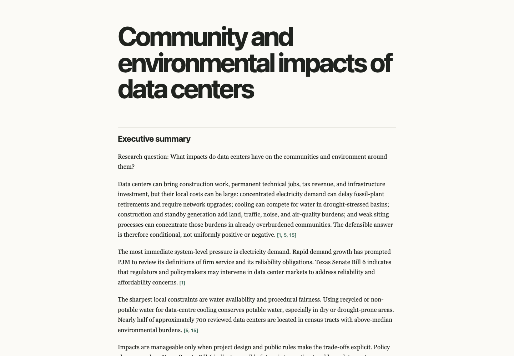
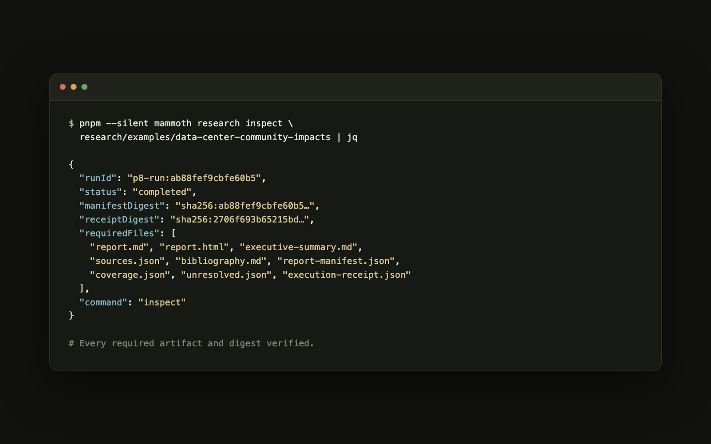

# mammoth

Local-first, hybrid, long-horizon epistemic engine.

The completed MVP contract is documented in [MVP_PLAN.md](MVP_PLAN.md). Post-MVP
delivery through P8 Turnkey Research is sequenced in
[POST_MVP_ROADMAP.md](POST_MVP_ROADMAP.md). P8 adds a local plain-language
question-to-report CLI for the current data-center-impact research domain, with
iterative evidence-bound research, immutable source snapshots, admitted-only
Markdown/HTML reports, and receipt-bearing live exhibition evidence. The future
read-only visualization contract is
[Mammoth Observatory](docs/OBSERVATORY.md). Autonomous workers follow
[AGENTS.md](AGENTS.md) and [LOOP.md](LOOP.md).
The original blind product critique is preserved in
[ADVERSARIAL_ANALYSIS.md](ADVERSARIAL_ANALYSIS.md); the post-P8 follow-up is
[ADVERSARIAL_ANALYSIS_POST_P8.md](ADVERSARIAL_ANALYSIS_POST_P8.md).

## See Mammoth work

The flagship live exhibition asks:

> What impacts do data centers have on the communities and environment around
> them?

Mammoth searched the public web, acquired and preserved 17 source snapshots,
bound 94 admitted claims to 119 exact evidence spans, and rendered a 3,433-word
report. The run used Brave Search plus `openai/gpt-5.6-luna` through OpenRouter;
an independent `anthropic/claude-sonnet-5` review returned `pass_with_notes`
with no blockers.

- [Read the completed report](research/examples/data-center-community-impacts/report.md)
- [Open the rendered HTML](research/examples/data-center-community-impacts/report.html)
- [Read the executive summary](research/examples/data-center-community-impacts/executive-summary.md)
- [Inspect the bibliography](research/examples/data-center-community-impacts/bibliography.md)
- [Inspect source provenance](research/examples/data-center-community-impacts/sources.json)
- [Inspect the execution receipt](research/examples/data-center-community-impacts/execution-receipt.json)
- [Read the independent review](research/examples/data-center-community-impacts/independent-review.json)



The same immutable bundle can be checked from the CLI. `research inspect`
verifies the run state, manifest and receipt digests, and every required artifact.



This is intentionally the only cross-source showcase today. P8's live planning
taxonomy and search program are still specialized for data-center impact
research; unrelated-topic examples would overstate the current product. The next
product milestone is a governed, question-derived planning layer that can produce
equally strong examples in unrelated domains without hard-coded topic templates.

## Development

Mammoth requires Node.js 22 or later and pnpm 8.15.6. From the repository root:

```sh
pnpm install
pnpm format:check
pnpm lint
pnpm typecheck
pnpm build
pnpm test
pnpm verify:evidence
pnpm verify:audit
pnpm verify:phase-1
pnpm verify:phase-2
pnpm verify:adapters
pnpm verify:m2
pnpm verify:m3
pnpm verify:mvp
pnpm verify:p2
pnpm verify:p3
pnpm verify:p4
pnpm verify:p5
pnpm verify:p6
pnpm verify:p7
pnpm verify:p8
pnpm eval:offline
git diff --check
```

Every verifier through `pnpm verify:p7` is independently runnable and enforced in
default-branch CI. `pnpm verify:p8` is a visible non-recursive verifier that
checks the frozen data-center acceptance path without changing the meaning of
earlier gates.

Run `pnpm format` to format tracked source and documentation, or
`pnpm format:check` to check formatting without changing files.

Workspace packages live under `apps/`, `packages/`, `workers/`, and `evals/`.
Packages should extend `tsconfig.base.json` and expose the applicable `build`,
`typecheck`, and `test` scripts; root commands run those scripts recursively.

## Implemented slices

- **Phase 0 — Constitution and failure harness:** domain schemas, claim lifecycle,
  evidence policy, handoff validation, audit integrity, and offline fixtures.
- **Phase 1 — Evidence-first vertical slice:** policy-gated retrieval, immutable
  content-addressed snapshots, deterministic parsing, source lineage, claim graph,
  crash-safe local persistence with a Postgres reference migration, and an
  evidence-bound report compiler with sentence-level provenance traces.
- **Phase 2 — Durable orchestration:** restart-safe workflow execution and
  schedules, leased task queues, provider-idempotent side-effect receipts,
  multi-dimensional budgets, human gates, and revalidation scheduling.
- **Initial MVP runtime:** a durable evidence-first research workflow, pinned
  fixture and entailment oracle, inspectable report/manifest/traces, audit and
  cancellation receipts, budget and revalidation gates, and a local operator CLI.
- **P2-P3 production-shaped control plane:** Postgres/CAS authority, forward-only
  migrations, production-profile lifecycle and backup gates, Temporal workflows,
  replay, cancellation, recovery, and bounded history.
- **P4-P5 isolated research cells:** immutable model lineage, correlation-aware
  admission, commit-before-reveal divergence, blind review, preserved dissent,
  bounded budgets, and honest partial cancellation.
- **P6 broader research topology:** deterministic multi-cell planning and
  scheduling, authoritative topology persistence, Temporal parent/child execution,
  evidence-aware synthesis, and read-only topology projection.
- **P7 governed execution substrate:** provider-backed typed cell work, governed
  egress and budgets, effect/cost receipts, reconstruction, dossier projection,
  operator controls, and restart-safe resume.
- **P8 turnkey research product:** local plain-language `research ask` intake for
  the current data-center-impact domain, Brave-backed live public-web discovery
  when authorized, immutable acquired source snapshots, admitted-only report
  manifests, Markdown/HTML reports, inspection, deterministic offline acceptance,
  and a receipt-bearing live exhibition.

`pnpm verify:phase-1` runs the Phase 1 exit-gate suites. The compiler fails closed
unless each factual sentence resolves through an eligible claim and named policy
assessment to fresh immutable evidence with an exact locator.

`pnpm verify:phase-2` runs the process-death and duplicate-delivery gates. Local
MVP stores use atomic rename plus file and directory fsync; runtime ports remain
compatible with the completed Postgres/CAS and Temporal production-shaped
adapters.

The MVP topology limits and production adapter boundary are recorded in
[`docs/adr/0001-local-durable-runtime.md`](docs/adr/0001-local-durable-runtime.md).

## Quickstart

The checked-in example is deterministic and network-free. It deliberately proposes
one claim supported by the source and one unsupported claim so the fail-closed
result is visible.

```sh
pnpm install --frozen-lockfile
pnpm --filter @mammoth/cli build
pnpm --silent mammoth run ./examples/quickstart/charter.json --root ./.mammoth --json
pnpm --silent mammoth status quickstart-example-domains --root ./.mammoth --json
pnpm --silent mammoth inspect quickstart-example-domains --root ./.mammoth --json
```

Interrupted programs can be continued with `mammoth resume`; `mammoth cancel`
commits a terminal partial receipt while preserving already completed artifacts.
The durable program directory contains workflow, queue, governance, ledger, CAS,
report, manifest, traces, operator state, and terminal receipt artifacts.

Run `pnpm mammoth --help` for all commands and options. The CLI exits with `0` on
success, `2` for invalid input, `3` when a program is absent, `4` for state
conflicts, and `5` for execution or integrity failures. `--json` always writes its
stable envelope to stdout when the built CLI or `pnpm --silent mammoth` is used;
diagnostics also go to stderr.

## Current product boundary

- This checkpoint provides a local CLI, not the deferred desktop UI or hosted API.
- The quickstart uses an immutable checked-in source. P8's reproducible release
  gate is fixture-backed; the authorized Brave-backed run is recorded separately
  as the live exhibition receipt.
- The CLI exposes the P7 operator path and the P8 plain-language `research ask`,
  `research status`, `research inspect`, and `research doctor` commands.
- P8's live search program, mandatory coverage topics, and report framing are
  currently data-center-specific. The CLI does not yet support honest
  arbitrary-domain research merely because it accepts a question string.
- Postgres/CAS and Temporal have production-shaped local profiles and recovery
  evidence, not a managed hosted deployment or production operations claim.
- Provider-dependent quality, cost, and reliability evaluations remain outside
  offline CI and must never be inferred from deterministic fixtures.
- Parliament provider execution, the hosted API, full Observatory UI, external
  stack adapters, and `mammoth-pipelines` remain future work.
- A completed run may honestly contain unresolved claims. Only supported claims
  with a named policy assessment and exact immutable locator render as report facts.
- Source parsing supports bounded plain text, HTML, JSON, and the P8 text-layer
  source path; browser rendering and OCR-heavy media remain deferred.
- `inspect` verifies terminal receipts and declared artifact digests but is not a
  repair command. Tampered state fails closed.
- The dossier remains `evidence_complete`; Mammoth never assigns human approval.
